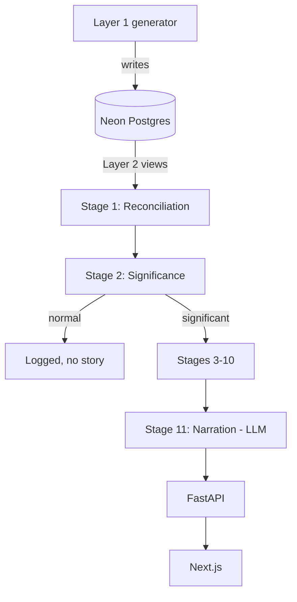

# Architecture Reference

Current-state summary. For the *why* behind any decision here, the linked design doc in `docs/02-stage-design-reports/` is authoritative — this file is a status index, not a replacement.

## System shape

| Unit | Role | Owns |
|---|---|---|
| Layer 1 (`pipeline/simulator/layer1_ground_truth/`) | Ground-truth generator | The one perfect, atomic-grain truth. Held out — never fed to the pipeline. |
| Layer 2 (`pipeline/simulator/layer2_observed_sources/`) | Degradation layer | 3 fragmented "source systems" as SQL views over Layer 1. What the pipeline actually ingests. |
| Stage 1–11 (`pipeline/stage0N_*/`) | The diagnostic pipeline | Reconciliation → significance → decomposition → fingerprint → debate → counterfactual → recommendation → narration |
| Cross-cutting (`pipeline/cross_cutting/`) | 7 shared services | Semantic Contract, Calendar Dimension, Identity Resolution Graph, Security/Access Filter, Decision Rights, Learning & Memory, Telemetry/Cost Governor |
| FastAPI backend | Not yet started | Will wrap the pipeline: `/detect`, `/investigate/{kpi_id}`, `/counterfactual`, `/story/{id}` |
| Next.js frontend | Not yet started | Executive Dashboard, Analyst View, drill-down chat, story export |

## Build status (the part that actually matters — don't assume a design doc means code exists)

| Component | Design | Code | Notes |
|---|---|---|---|
| Layer 1 ground truth | ✅ | ✅ | 150 episodes live in Neon. Olist-bootstrapped, multi-event episodes, reactive chaining, volatility regimes. |
| Layer 2 observed sources | ✅ | ✅ | 6 views, 6 of 7 reconciliation scenarios. Scenario 3 (mutable history) deferred — needs a Layer 1 schema extension. |
| Stage 1 — Reconciliation & Ingestion | ✅ | ✅ (first slice) | Scenarios 1/2/4-partial/5/6 built, `test_reconcile.py` passing offline + live. Scenario 3, 4-total-gap, and Scenario 7 deferred (need Stage 2). See `.claude/plans/stage1-reconciliation-ingestion.md` |
| Stage 2 — Significance Detection | ✅ | ✅ (first slice) | Relevance extraction (eligibility → baseline → unusualness → candidate selection → business importance → relevance) + EMERGING/SIGNIFICANT/STRUCTURAL classification, `test_stage2.py` passing offline + live (incl. a real scoring check against `injected_events`). See `.claude/plans/stage2-relevance-extraction.md` |
| Stage 3 — Cross-KPI Correlation | ✅ | ✅ (first slice) | DAG lookup (Stage 2's one real edge, lag/direction-annotated) + correlation grouping, revenue-equivalent dollar prioritization, `test_stage3.py` passing offline + live (incl. a real clustering check against `injected_events`). Case 2 (projected priority) and multi-path combination (3+ members) are structurally untestable with the current 2-KPI universe — gated, not fabricated. See `.claude/plans/stage3-cross-kpi-correlation.md` |
| Stage 4 — Dimensional Decomposition | ✅ | ✅ (first slice) | 5 new sliced `billing_system` Layer 2 views (region/segment/product) + per-slice decomposition reusing Stage 2's real eligibility/baseline/unusualness directly, `test_stage4.py` passing offline + live-DB. Live verification overturned the plan's a-priori "small regions land LIMITED_HISTORY" assumption — eligibility turns out to be driven by window recency, not slice size, given the new views' zero-scaffolding. See `.claude/plans/stage4-dimensional-decomposition.md` and `stage04_dimensional_decomposition/README.md`. |
| Stage 5a–11 | ❌ | ❌ | Not yet designed |
| KPI Semantic Contract | Partially — specified inside Stage 1's design report §3.1 | ✅ (as `stage01_reconciliation_ingestion/semantic_contract.py`) | Not yet split into its own standalone `pipeline/cross_cutting/` module |
| Calendar Dimension | Partially — Stage 1's design report §3.2 | ✅ (as `stage01_reconciliation_ingestion/calendar_dimension.py`) | Not yet split out standalone |
| Identity Resolution Graph | Partially — Stage 1's design report §3.3 | ✅ (as `stage01_reconciliation_ingestion/identity_resolution.py`, single-field scoring only — see plan Risk #2) | The one genuinely new cross-cutting component from Stage 1's design; not yet split out standalone |
| Security/Decision Rights/Learning & Memory/Telemetry | ❌ | ❌ | Not yet designed |
| FastAPI backend | Tech-stack decided | ❌ | |
| Next.js frontend | Tech-stack decided | ❌ | |

## Runtime architecture (once Stage 1+ exist)

## Boundary rules

- Nothing downstream of Layer 2 ever queries Layer 1's raw tables directly, and nothing ever queries `injected_events` except offline scoring.
- The LLM boundary is absolute: only Stage 11 calls an LLM. If any earlier stage's code path calls an LLM to decide something (not just format something already decided), that's a bug against the architecture's one hard rule.
- Each pipeline stage's design report has an explicit **output contract** section — the next stage's implementation should be built against that contract, not against assumptions about what "should" be there.

## Critical flows (once built)

1. Episode/day of real (production) data → Stage 1 reconciles → Stage 2 significance-gates → (if significant) Stages 3–10 investigate → Stage 11 narrates per persona.
2. A noise episode → Stage 2 declines → logged, no LLM call spent, no story manufactured.
3. Offline: any pipeline run on a held-out simulator episode → compared against that episode's `injected_events` → scored (precision/recall, top-1/3 accuracy, false-causality rate, counterfactual MAE).

## Known architectural risks

- No root-level Python package/manifest yet — each pipeline module is independently venv'd. This has now bitten four times: Stage 2 importing Stage 1's `reconcile.py`; Stage 3 importing Stage 2's `stage2`/`ingest`/`baseline`; Stage 4 importing Stage 2's `eligibility`/`baseline`/`unusualness` directly (`stage04_dimensional_decomposition/stage2_bridge.py`) *and* importing Stage 3's `run_stage3` (`stage04_dimensional_decomposition/stage3_bridge.py`, used by the CLI path only) — all via `sys.path` insert + `sys.modules`-eviction to dodge same-named-module collisions (`models.py` exists in all four stages; each bridge module is deliberately not named `ingest.py`/`stage2_bridge.py` where that would collide with the module it's importing). A fourth stage needing this cross-import has now happened — consolidating into a real package is overdue, not just "worth revisiting."
- Stage 4's new sliced Layer 2 views deliberately scaffold every `(day, slice_value)` pair with `COALESCE(..., 0)` so a real zero-order day isn't confused with a data gap. A side effect (confirmed live, not assumed): `eligibility.assess_eligibility` counts a `0`-valued observation as usable, so for a given window every slice of a KPI gets the *same* eligibility regardless of slice size — eligibility is driven by window recency (trailing history depth), not by region/segment/product sparsity. See `stage04_dimensional_decomposition/README.md`'s live-verification note before assuming small-slice sparsity shows up as `LIMITED_HISTORY`/`INSUFFICIENT_DATA`; it doesn't, by design.
- Stage 3's real KPI universe (2 KPIs, 1 edge) makes the design doc's Case 2 (projected priority) and multi-path combination (3+-member clusters) structurally untestable, not just unimplemented — see `stage03_cross_kpi_correlation/README.md`'s Known Gaps.
- Scenario 3 (mutable history) in Layer 2 is a known, documented gap, not an oversight — revisit once/if the team decides it's worth the Layer 1 schema change.
- Stage 2's `target_candidate_rate` (0.30) and temporal classification day-counts (3/10) are prototype knobs calibrated against a small number of live episodes, not a validated statistical threshold — see plan Risk #4.
