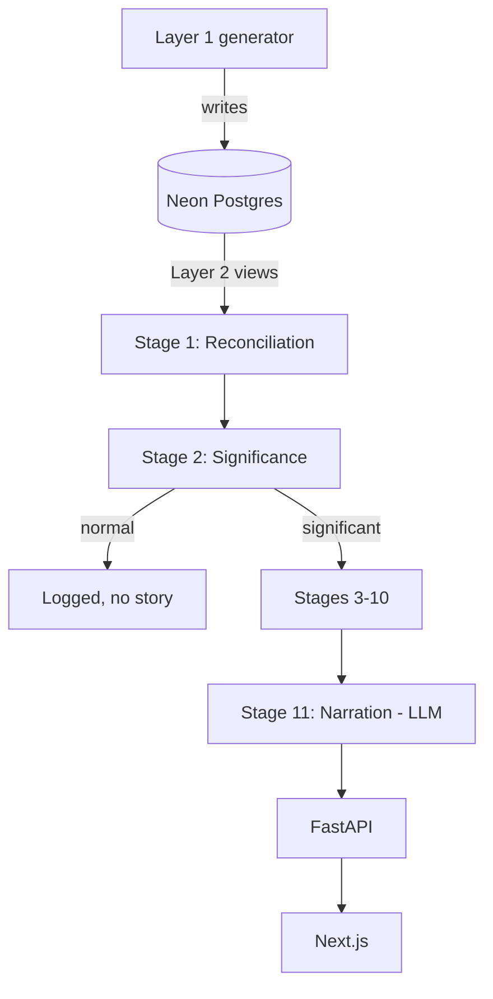

# Architecture Reference

Current-state summary. For the *why* behind any decision here, the linked design doc in `docs/02-stage-design-reports/` is authoritative — this file is a status index, not a replacement.

## System shape

| Unit | Role | Owns |
|---|---|---|
| Layer 1 (`pipeline/simulator/layer1_ground_truth/`) | Ground-truth generator | The one perfect, atomic-grain truth. Held out — never fed to the pipeline. |
| Layer 2 (`pipeline/simulator/layer2_observed_sources/`) | Degradation layer | 3 fragmented "source systems" as SQL views over Layer 1. What the pipeline actually ingests. |
| Stage 1–11 (`pipeline/stage0N_*/`) | The diagnostic pipeline | Reconciliation → significance → decomposition → fingerprint → debate → counterfactual → recommendation → narration |
| Cross-cutting (`pipeline/cross_cutting/`) | 7 shared services | Semantic Contract, Calendar Dimension, Identity Resolution Graph, Security/Access Filter, Decision Rights, Learning & Memory, Telemetry/Cost Governor |
| FastAPI backend | Not yet started | Will wrap the pipeline: `/detect`, `/investigate/{kpi_id}`, `/counterfactual`, `/story/{id}` |
| Next.js frontend | Not yet started | Executive Dashboard, Analyst View, drill-down chat, story export |

## Build status (the part that actually matters — don't assume a design doc means code exists)

| Component | Design | Code | Notes |
|---|---|---|---|
| Layer 1 ground truth | ✅ | ✅ | 150 episodes live in Neon. Olist-bootstrapped, multi-event episodes, reactive chaining, volatility regimes. |
| Layer 2 observed sources | ✅ | ✅ | 6 views, 6 of 7 reconciliation scenarios. Scenario 3 (mutable history) deferred — needs a Layer 1 schema extension. |
| Stage 1 — Reconciliation & Ingestion | ✅ | ✅ (first slice) | Scenarios 1/2/4-partial/5/6 built, `test_reconcile.py` passing offline + live. Scenario 3, 4-total-gap, and Scenario 7 deferred (need Stage 2). See `.claude/plans/stage1-reconciliation-ingestion.md` |
| Stage 2 — Significance Detection | ✅ | ✅ (first slice) | Relevance extraction (eligibility → baseline → unusualness → candidate selection → business importance → relevance) + EMERGING/SIGNIFICANT/STRUCTURAL classification, `test_stage2.py` passing offline + live (incl. a real scoring check against `injected_events`). See `.claude/plans/stage2-relevance-extraction.md` |
| Stage 3 — Cross-KPI Correlation | ✅ | ✅ (first slice) | DAG lookup (Stage 2's one real edge, lag/direction-annotated) + correlation grouping, revenue-equivalent dollar prioritization, `test_stage3.py` passing offline + live (incl. a real clustering check against `injected_events`). Case 2 (projected priority) and multi-path combination (3+ members) are structurally untestable with the current 2-KPI universe — gated, not fabricated. See `.claude/plans/stage3-cross-kpi-correlation.md` |
| Stage 4 — Dimensional Decomposition | ✅ | ✅ (first slice) | 5 new sliced `billing_system` Layer 2 views (region/segment/product) + per-slice decomposition reusing Stage 2's real eligibility/baseline/unusualness directly, `test_stage4.py` passing offline + live-DB. Live verification overturned the plan's a-priori "small regions land LIMITED_HISTORY" assumption — eligibility turns out to be driven by window recency, not slice size, given the new views' zero-scaffolding. See `.claude/plans/stage4-dimensional-decomposition.md` and `stage04_dimensional_decomposition/README.md`. |
| Stage 5a — Fingerprint Classification | ✅ (revised) | ✅ (first slice) | Tier A heuristic classifier over the real 4-class taxonomy (`product_concentration`/`dominant_kpi_shift`/`onset_lean`), `test_stage5a.py` passing offline + live-DB. `product_concentration` now excludes `LIMITED_HISTORY`/`INSUFFICIENT_DATA` product slices (Stage 5c follow-up — see below). See `.claude/plans/stage5a-fingerprint-classification.md` and `stage05a_fingerprint_classification/README.md`. |
| Stage 5b — Confounded-Cause Decomposer | ✅ (revised) | ✅ (first slice) | NNLS-style basis-fit attribution over a reduced 5-episode-per-cause basis, declared + empirical identifiability gate, `test_stage5b.py` passing offline + live-DB. See `docs/02-stage-design-reports/stage5b-confounded-cause-decomposer-revised.md` and `stage05b_confounded_cause_decomposer/README.md`. |
| Stage 5c — Cold-Start / Analogy Handler | ✅ (revised) | ✅ (first slice) | Design doc's declared per-slice analog (`analogy_groups.yaml`) replaced with a cross-episode corpus reference distribution — Stage 4's eligibility is uniform per `(kpi, dimension)` across a decomposition, so a same-window sibling slice is never a valid analog (see Known Risks below). Wired into Stage 5a via `stage5a.py`'s `run_stage5a_and_5c`. `test_stage5c.py` passing offline + live-DB. See `.claude/plans/stage5c-cold-start-analogy-handler.md` and `stage05c_cold_start_analogy_handler/README.md`. |
| Stage 6 — Evidence Retrieval & Linking | ✅ (revised) | ✅ (first slice) | Customer-centric slice only -- product reviews descoped, no such table exists in Layer 1 (see plan Risk #1). `support_tickets.text` (nullable) added live + a small seeded demo corpus (episode 15, 188 rows) for one real inventory_shortage cluster (`cluster_15_93_94`, `auto` product concentration, reused from Stage 5a's own live-verified fixture). Segment/region concentration checked the same way product's already was -- neither clears a real bar in this cluster (this event's `affected_segment` is unset), so only `product` is a real flagged facet; zero flagged facets is a legitimate, handled outcome, not an error. Live funnel: 188 → 78 (scope filter) → 78 (temporal tag, none excluded) → 3 (semantic relevance, MiniLM) -- all 3 the real seeded evidence, no decoys leaked. `RELEVANCE_THRESHOLD` recalibrated from the design doc's un-verified 0.6 to a live-checked 0.35 (all-MiniLM-L6-v2 scores short ticket text lower than 0.6 for genuine matches -- see `stage06_evidence_retrieval/embedding_index.py`). `test_stage6.py` passing offline + live-DB. See `.claude/plans/stage6-evidence-retrieval.md`. |
| Stage 7 — Hypothesis Debate & Ranking | ✅ (revised) | ✅ (first slice) | Constrained hypothesis construction (single from Stage 5a's floor-filtered `cause_scores`, compound only from Stage 5b's `NON_IDENTIFIABLE_JOINT` components — mechanisms 9.2/9.3 out of scope, `DEPENDENT_PAIRS` already consumed upstream by Stage 5b) + deterministic support/contradiction/confidence resolution (rule table, never a weighted score) + ranking with shared `rank_group` ties + abstention. `test_stage7.py` passing offline + live-DB (episode 15). Several design-doc input assumptions were wrong against the real Stage 5c/6 contracts (5c attributes a KPI slice, not a cause; Stage 6's evidence carries no `candidate_causes`/`support_direction`/`strength` and is implicitly retrieved for `top_cause` only) — reduced, stated rules substitute for both, see `stage07_hypothesis_debate_ranking/README.md` and `.claude/plans/stage7-hypothesis-debate-ranking.md`. |
| Stage 8 — Counterfactual Impact Engine | ✅ (revised) | ✅ (first slice) | The design doc's per-cause `InterventionMechanism` registry (re-simulating `daily_state` internals) is architecturally impossible here — nothing downstream of Layer 2 may query Layer 1 raw tables, and every one of the 4 causes' real mechanics (traced in `generate.py`) reads `daily_state.reliability`/`.marketing_spend`/`.competitor_activity`. Only validated mechanism in this codebase: Stage 5b's fitted `share`, applied as `counterfactual = observed - share * residual` against Stage 1/2's real baseline (`ingest.load_kpi_timeline` + `baseline.compute_residuals`, reused not redefined). A hypothesis without a matching Stage 5b `CauseContribution` returns `MECHANISM_UNAVAILABLE` — most hypotheses, since Stage 5b's `router.should_fork()` only fires on narrow-margin clusters. `test_stage8.py` passing offline + live-DB (episode 15, correctly all-`MECHANISM_UNAVAILABLE` on the no-fork cluster it landed on). See `stage08_counterfactual_impact/README.md` and `.claude/plans/stage8-counterfactual-impact-engine.md`. |
| Stage 9-11 | ❌ | ❌ | Not yet designed |
| KPI Semantic Contract | Partially — specified inside Stage 1's design report §3.1 | ✅ (as `stage01_reconciliation_ingestion/semantic_contract.py`) | Not yet split into its own standalone `pipeline/cross_cutting/` module |
| Calendar Dimension | Partially — Stage 1's design report §3.2 | ✅ (as `stage01_reconciliation_ingestion/calendar_dimension.py`) | Not yet split out standalone |
| Identity Resolution Graph | Partially — Stage 1's design report §3.3 | ✅ (as `stage01_reconciliation_ingestion/identity_resolution.py`, single-field scoring only — see plan Risk #2) | The one genuinely new cross-cutting component from Stage 1's design; not yet split out standalone |
| Security/Decision Rights/Learning & Memory/Telemetry | ❌ | ❌ | Not yet designed |
| FastAPI backend | Tech-stack decided | ❌ | |
| Next.js frontend | Tech-stack decided | ❌ | |

## Runtime architecture (once Stage 1+ exist)

## Boundary rules

- Nothing downstream of Layer 2 ever queries Layer 1's raw tables directly, and nothing ever queries `injected_events` except offline scoring.
- The LLM boundary is absolute: only Stage 11 calls an LLM. If any earlier stage's code path calls an LLM to decide something (not just format something already decided), that's a bug against the architecture's one hard rule.
- Each pipeline stage's design report has an explicit **output contract** section — the next stage's implementation should be built against that contract, not against assumptions about what "should" be there.

## Critical flows (once built)

1. Episode/day of real (production) data → Stage 1 reconciles → Stage 2 significance-gates → (if significant) Stages 3–10 investigate → Stage 11 narrates per persona.
2. A noise episode → Stage 2 declines → logged, no LLM call spent, no story manufactured.
3. Offline: any pipeline run on a held-out simulator episode → compared against that episode's `injected_events` → scored (precision/recall, top-1/3 accuracy, false-causality rate, counterfactual MAE).

## Known architectural risks

- No root-level Python package/manifest yet — each pipeline module is independently venv'd. This has now bitten four times: Stage 2 importing Stage 1's `reconcile.py`; Stage 3 importing Stage 2's `stage2`/`ingest`/`baseline`; Stage 4 importing Stage 2's `eligibility`/`baseline`/`unusualness` directly (`stage04_dimensional_decomposition/stage2_bridge.py`) *and* importing Stage 3's `run_stage3` (`stage04_dimensional_decomposition/stage3_bridge.py`, used by the CLI path only) — all via `sys.path` insert + `sys.modules`-eviction to dodge same-named-module collisions (`models.py` exists in all four stages; each bridge module is deliberately not named `ingest.py`/`stage2_bridge.py` where that would collide with the module it's importing). A fourth stage needing this cross-import has now happened — consolidating into a real package is overdue, not just "worth revisiting." Stage 5a/5b/5c have each added their own bridges since (Stage 5c bridges to Stage 2/3/4; Stage 5a additionally bridges *sideways* into Stage 5c via `stage05a_fingerprint_classification/stage5c_bridge.py`, a sibling-to-sibling import rather than strictly backward — same reasoning Stage 5b already used bridging into Stage 5a despite the numeric order) — the real-package case is stronger with every stage, still not folded into any of these slices.
- Stage 4's new sliced Layer 2 views deliberately scaffold every `(day, slice_value)` pair with `COALESCE(..., 0)` so a real zero-order day isn't confused with a data gap. A side effect (confirmed live, not assumed): `eligibility.assess_eligibility` counts a `0`-valued observation as usable, so for a given window every slice of a KPI gets the *same* eligibility regardless of slice size — eligibility is driven by window recency (trailing history depth), not by region/segment/product sparsity. See `stage04_dimensional_decomposition/README.md`'s live-verification note before assuming small-slice sparsity shows up as `LIMITED_HISTORY`/`INSUFFICIENT_DATA`; it doesn't, by design. **Direct consequence for Stage 5c:** a "some slices thin, others solid, same decomposition" mixed cluster is structurally unreachable — every slice_value of a given `(kpi, dimension)` shares the same eligibility tier, so a same-window sibling is never a valid analog. Stage 5c's reference distribution is sourced cross-episode instead (see `stage05c_cold_start_analogy_handler/README.md`).
- Stages 1–2 now reconcile and analyze **5 KPIs** (`revenue`, `active_customers_purchased_30d`, `orders_count`, `avg_order_value`, `units_sold` — F14), driven by Stage 1's `reconcile.SOURCES` registry and a real 5-edge DAG in `relationship_graph.py`. **Stage 3 still runs only the original 2-KPI pair** (`stage3.py` hardcodes `_UPSTREAM_KPI`/`_DOWNSTREAM_KPI`), so the design doc's Case 2 (projected priority) and multi-path combination (3+-member clusters) remain structurally untestable until Stage 3 iterates the DAG instead of one hardcoded edge — see `stage03_cross_kpi_correlation/README.md`'s Known Gaps. **Stage 4 slices only the original 2 KPIs**: `DIMENSION_APPLICABILITY` returns `[]` for the new ones, so they are skipped cleanly rather than crashing, and no sliced views were added for them.
- Scenario 3 (mutable history) in Layer 2 is a known, documented gap, not an oversight — revisit once/if the team decides it's worth the Layer 1 schema change.
- Stage 2's `target_candidate_rate` (0.30) and temporal classification day-counts (3/10) are prototype knobs calibrated against a small number of live episodes, not a validated statistical threshold — see plan Risk #4.
- A fifth cross-import wrinkle (Stage 6): Stage 5a's `run_stage5a_and_5c` does its own *lazy* `import stage5c_bridge` inside the function body rather than at module load time, which only resolves via `sys.path` at call time. A cross-directory bridge that removes its `sys.path` entry immediately after import (every bridge in this repo does) breaks that call once invoked from outside `stage05a_fingerprint_classification/`'s own process context. `stage06_evidence_retrieval/stage5a_bridge.py` works around it by deliberately leaving `stage5c_bridge` (and only that name) in `sys.modules` after import, so the later `import stage5c_bridge` resolves from cache instead of a path lookup. Any future stage re-wrapping `run_stage5a_and_5c` needs the same workaround.
- A sixth cross-import wrinkle (Stage 7): Stage 5b and Stage 7 each ship their own file literally named `stage4_bridge.py` (Stage 5b's own, used internally by its `deviation_matrix.py` for slice-fetcher access; Stage 7's own, re-exporting `run_stage3`/`run_stage4`). `sys.modules` caches by bare module name, not path, so when Stage 7's `stage5b_bridge.py` imports `stage5b`, which imports `deviation_matrix`, which imports `stage4_bridge`, that import resolves to Stage 5b's own `stage4_bridge.py` and gets cached under the bare name `"stage4_bridge"`. Left un-evicted, it silently poisons every later plain `import stage4_bridge` in the same process — caught live as `AttributeError: module 'stage4_bridge' has no attribute 'run_stage3'` when Stage 7's own bridge tried to import its own file of that name afterward and got the stale, wrong one back instead. Fixed by adding `"stage4_bridge"` to `stage07_hypothesis_debate_ranking/stage5b_bridge.py`'s eviction list. Any future bridge chaining through Stage 5b's `deviation_matrix.py` needs the same fix.
- A seventh cross-import wrinkle (Stage 8): `stage02_significance_detection/ingest.py`'s own bridge into Stage 1 (`_import_stage1_reconcile`) only evicts its `_STAGE1_MODULE_NAMES` (including `"models"`) *after* importing `reconcile.py`, never before. Every stage in this repo has its own `models.py`, so if the calling process already imported a *different* stage's `models` before reaching Stage 2's bridge (e.g. Stage 8's own `output_schema.py` does `from models import ...` for its own `models.py`, and Stage 8's `test_stage8.py`/`stage8.py` both import it before the module that reaches into Stage 2), `sys.modules["models"]` is already cached under the wrong file, and Stage 1's `reconcile.py`'s own `from models import ReconciledValue` silently resolves to the wrong `models.py` — caught live as `ImportError: cannot import name 'ReconciledValue' from 'models'`. Fixed defensively from the caller's side: `stage08_counterfactual_impact/canonical_bridge.py` evicts `"models"` in its own pre-import loop even though `"models"` isn't one of Stage 2's own three module names — it's the transitively-reached name that actually collides. Any future bridge reaching into `stage02_significance_detection/ingest.py` (not just Stage 2's own three names) needs the same defensive `"models"` eviction.
