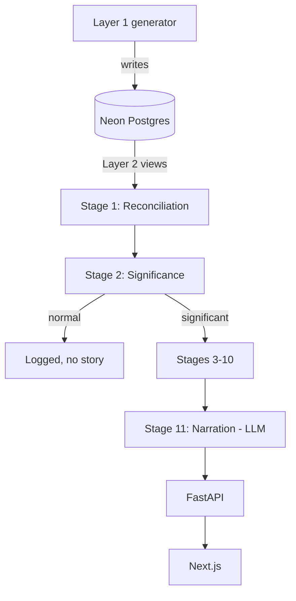

# Architecture Reference

Current-state summary. For the *why* behind any decision here, the linked design doc in `docs/02-stage-design-reports/` is authoritative — this file is a status index, not a replacement.

## System shape

| Unit | Role | Owns |
|---|---|---|
| Layer 1 (`pipeline/simulator/layer1_ground_truth/`) | Ground-truth generator | The one perfect, atomic-grain truth. Held out — never fed to the pipeline. |
| Layer 2 (`pipeline/simulator/layer2_observed_sources/`) | Degradation layer | 3 fragmented "source systems" as SQL views over Layer 1. What the pipeline actually ingests. |
| Stage 1–11 (`pipeline/stage0N_*/`) | The diagnostic pipeline | Reconciliation → significance → decomposition → fingerprint → debate → counterfactual → recommendation → narration |
| Cross-cutting (`pipeline/cross_cutting/`) | 7 shared services | Semantic Contract, Calendar Dimension, Identity Resolution Graph, Security/Access Filter, Decision Rights, Learning & Memory, Telemetry/Cost Governor |
| FastAPI backend | Not yet started | Will wrap the pipeline: `/detect`, `/investigate/{kpi_id}`, `/counterfactual`, `/story/{id}` |
| Next.js frontend | Not yet started | Executive Dashboard, Analyst View, drill-down chat, story export |

## Build status (the part that actually matters — don't assume a design doc means code exists)

| Component | Design | Code | Notes |
|---|---|---|---|
| Layer 1 ground truth | ✅ | ✅ | 150 episodes live in Neon. Olist-bootstrapped, multi-event episodes, reactive chaining, volatility regimes. |
| Layer 2 observed sources | ✅ | ✅ | 6 views, 6 of 7 reconciliation scenarios. Scenario 3 (mutable history) deferred — needs a Layer 1 schema extension. |
| Stage 1 — Reconciliation & Ingestion | ✅ | ✅ (first slice) | Scenarios 1/2/4-partial/5/6 built, `test_reconcile.py` passing offline + live. Scenario 3, 4-total-gap, and Scenario 7 deferred (need Stage 2). See `.claude/plans/stage1-reconciliation-ingestion.md` |
| Stage 2 — Significance Detection | ✅ | ✅ (first slice) | Relevance extraction (eligibility → baseline → unusualness → candidate selection → business importance → relevance) + EMERGING/SIGNIFICANT/STRUCTURAL classification, `test_stage2.py` passing offline + live (incl. a real scoring check against `injected_events`). See `.claude/plans/stage2-relevance-extraction.md` |
| Stage 3 — Cross-KPI Correlation | ✅ | ❌ | |
| Stage 4 — Dimensional Decomposition | ✅ (implementation plan ready) | ❌ | Stage 2's *actual* function interface is now confirmed to differ from what Stage 4's design report §4 assumed (list-based, not `pandas.Series`) — Stage 4 needs to write the adapter its own design doc already anticipated, not re-derive the logic. See `stage02_significance_detection/README.md`. |
| Stage 5a–11 | ❌ | ❌ | Not yet designed |
| KPI Semantic Contract | Partially — specified inside Stage 1's design report §3.1 | ✅ (as `stage01_reconciliation_ingestion/semantic_contract.py`) | Not yet split into its own standalone `pipeline/cross_cutting/` module |
| Calendar Dimension | Partially — Stage 1's design report §3.2 | ✅ (as `stage01_reconciliation_ingestion/calendar_dimension.py`) | Not yet split out standalone |
| Identity Resolution Graph | Partially — Stage 1's design report §3.3 | ✅ (as `stage01_reconciliation_ingestion/identity_resolution.py`, single-field scoring only — see plan Risk #2) | The one genuinely new cross-cutting component from Stage 1's design; not yet split out standalone |
| Security/Decision Rights/Learning & Memory/Telemetry | ❌ | ❌ | Not yet designed |
| FastAPI backend | Tech-stack decided | ❌ | |
| Next.js frontend | Tech-stack decided | ❌ | |

## Runtime architecture (once Stage 1+ exist)

## Boundary rules

- Nothing downstream of Layer 2 ever queries Layer 1's raw tables directly, and nothing ever queries `injected_events` except offline scoring.
- The LLM boundary is absolute: only Stage 11 calls an LLM. If any earlier stage's code path calls an LLM to decide something (not just format something already decided), that's a bug against the architecture's one hard rule.
- Each pipeline stage's design report has an explicit **output contract** section — the next stage's implementation should be built against that contract, not against assumptions about what "should" be there.

## Critical flows (once built)

1. Episode/day of real (production) data → Stage 1 reconciles → Stage 2 significance-gates → (if significant) Stages 3–10 investigate → Stage 11 narrates per persona.
2. A noise episode → Stage 2 declines → logged, no LLM call spent, no story manufactured.
3. Offline: any pipeline run on a held-out simulator episode → compared against that episode's `injected_events` → scored (precision/recall, top-1/3 accuracy, false-causality rate, counterfactual MAE).

## Known architectural risks

- Stage 4's design assumed a `pandas.Series`-based Stage 2 interface that doesn't match what got built (list-based, see `stage02_significance_detection/README.md`) — Stage 4's own design doc already anticipated this and calls for an adapter layer, not a rewrite of Stage 2.
- No root-level Python package/manifest yet — each pipeline module is independently venv'd. This has now actually bitten once: Stage 2 importing Stage 1's `reconcile.py` via `sys.path` caused a real module-name collision (`models.py` exists in both) that had to be worked around by evicting cache entries after the import (`stage02_significance_detection/ingest.py`). Consolidate into a real package once a third stage needs the same cross-import.
- Scenario 3 (mutable history) in Layer 2 is a known, documented gap, not an oversight — revisit once/if the team decides it's worth the Layer 1 schema change.
- Stage 2's `target_candidate_rate` (0.30) and temporal classification day-counts (3/10) are prototype knobs calibrated against a small number of live episodes, not a validated statistical threshold — see plan Risk #4.
