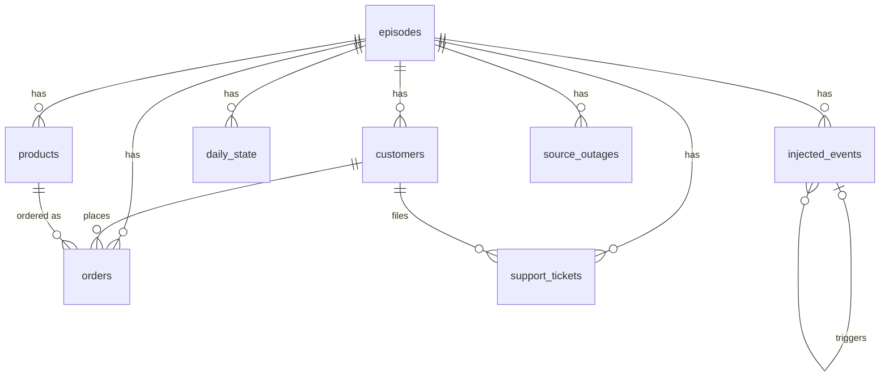

# Database Reference

## Principles

- One shared **Neon Postgres** database, not local SQLite — the whole team reads/writes the same live instance from day one.
- Layer 1 is atomic-grain, and KPIs are **never stored** — revenue/orders-count/AOV/active-customers are all `SUM`/`COUNT`/`GROUP BY` queries over atomic rows, so nothing can silently drift out of sync with what actually happened (worked examples: `docs/02-stage-design-reports/stage0-simulator-database-schema.md` §3).
- Layer 2 is views (+ one small support table), not materialized copies — always reflects current Layer 1 state, and its SQL is inspectable for the lineage-parsing trick Stage 1's design depends on.
- No ORM. Raw SQL via `psycopg2`, with `execute_values` for batch inserts — **always set an explicit `page_size`**, the library default (100) is far too small against a remote host and was the direct cause of a 3.5x-slower-than-necessary generation run before it was caught.

## Connection

`DATABASE_URL` env var (Neon connection string). Never committed — see `.env.example` at repo root for the shape. Each pipeline module reads it via `python-dotenv` + `os.environ["DATABASE_URL"]`.

```bash
psql "$DATABASE_URL" -c '\dt'      # list tables
psql "$DATABASE_URL" -f schema.sql # apply a module's schema
```

## Entity map (Layer 1 + Layer 2)



## Layer 1 — ground truth (`pipeline/simulator/layer1_ground_truth/schema.sql`)

| Table | Grain | Key columns |
|---|---|---|
| `episodes` | 1 / simulated company timeline | `seed`, `n_days`, `start_date` |
| `customers` | 1 / customer | `segment` (New/Returning/VIP — RFM tier computed from actual orders, **not** SMB/Enterprise — Olist is B2C), `region` (real Olist state), `signup_day_offset`, `churned_day_offset` |
| `products` | 1 / product | `category`, `unit_cost`, `base_price` — Olist-bootstrapped |
| `daily_state` | 1 / (episode, day) | latent driving variables: `marketing_spend`, `seasonality_factor`, `traffic`, `conversion_rate`, `product_reliability` (bounded [0.05, 1.0] — friction only pulls down from a 1.0 ideal), `satisfaction`, `competitor_activity`, `churn_rate`, `volatility_multiplier` |
| `orders` | 1 / order (atomic) | `customer_id`, `product_id`, `quantity`, `unit_price` — revenue/AOV/orders-count all derive from here |
| `support_tickets` | 1 / ticket (atomic) | `customer_id`, `category` |
| `injected_events` | 0–N / episode | **the answer key, held out.** `event_type`, `severity`, `onset_type`, `start_day_offset`, `end_day_offset`, `mitigation_day_offset`/`mitigation_completeness`, `magnitude`, `segment_multiplier`, `affected_segment`, `affected_product_id`, `triggered_by_event_id` (self-FK, reactive chaining) |

## Layer 2 — observed sources (`pipeline/simulator/layer2_observed_sources/`)

`schema_layer2.sql` adds one table: `source_outages(episode_id, source_name, metric_name nullable, start_day_offset, end_day_offset)` — `metric_name IS NULL` means the whole source goes dark (total gap); a specific value means only that metric is suppressed (partial gap).

`views.sql` — 6 views, 3 fragmented "source systems," each real-data-motivated:

| View | Source | Grain | What it demonstrates |
|---|---|---|---|
| `v_billing_daily_revenue` | billing_system | daily/UTC | exact revenue/orders/AOV |
| `v_billing_active_customers` | billing_system | daily | purchase-based active (trailing 30d) |
| `v_crm_weekly_active_customers` | crm_system | ISO week (Monday-start) | broader "active" (order **or** ticket) — definitional mismatch + calendar grain |
| `v_crm_customer_mapping` | crm_system | — | synthetic account IDs, ~3% unmerged duplicates, ~2% wrong-customer near-misses |
| `v_marketing_daily_attributed_revenue` | marketing_system | daily | biased revenue (0.87×, silently → 0.80× at episode midpoint) — conflicting values + silent drift |
| `v_marketing_monthly_active_customers` | marketing_system | 30-day billing-cycle (day-15 start) | same definition as billing, isolates calendar misalignment |

**Deferred, not implemented:** Scenario 3 (late-arriving/mutable history) — inherently temporal, can't be honestly represented by a view over data generated once. Needs `returned_day_offset` added to `orders` in Layer 1 first.

**Stage 4 sliced `billing_system` views** (added for dimensional decomposition — `.claude/plans/stage4-dimensional-decomposition.md`): `v_billing_daily_revenue_by_region`/`_segment`/`_product`, `v_billing_active_customers_by_region`/`_segment` (no `_by_product` — a customer isn't tied to one product). Each scaffolds every `(day_offset, slice_value)` pair via the real distinct dimension values (`customers.region`/`.segment`, `products.category`) and `COALESCE`s a no-orders slice-day to `0`, so a real zero-order day is never a missing row — same whole-day `source_outages` suppression as the un-sliced billing views. Verified live against episode 1 (row counts = `n_days x distinct slice values`, sliced revenue sums back to the un-sliced daily total) and episode 8's real billing outage (suppressed identically sliced and un-sliced).

## Migration/model note

`customers.segment`'s CHECK constraint was migrated live once already (`SMB/Enterprise` → `New/Returning/VIP`) via `ALTER TABLE ... DROP/ADD CONSTRAINT` on the shared Neon DB, with stale test data truncated first. If a schema change is needed again on a **shared, already-populated** database: prefer `ALTER TABLE` over drop/recreate where possible, and always regenerate/re-verify against live data afterward — this project's real bugs were only ever caught that way, not by reading the code.

## Current live state (as of last generation run)

150 episodes, ~1.24M customers, ~1.36M orders, ~765K support tickets, 152 injected events, 112 source outages. ~333MB total. Orders/customer ≈ 1.065 (real Olist: ≈1.03 — this was a deliberately-matched calibration target, not a coincidence). Regenerate with `pipeline/simulator/layer1_ground_truth/generate.py --reset` if the dataset needs refreshing after a model change.

## Sensitive data

None yet — this is entirely synthetic data. Once real customer data (if any) enters the picture, this section needs a real audit; don't copy this "none" forward without checking.
