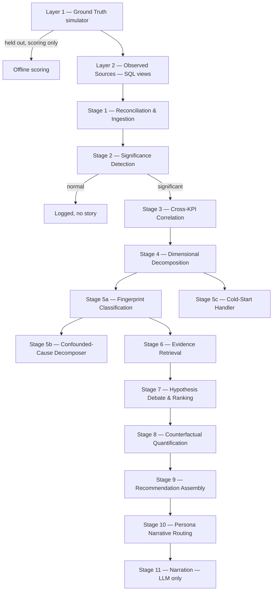

# CONSTITUTION.md

## Project Overview
- Product: PS3 — BusinessIntelligence.ai — a KPI storytelling / root-cause diagnostic engine, built for the Accenture Innovation Challenge (AIC) 2026, Round 2 (Prototype Development).
- Users: business analysts and execs investigating why a KPI moved. Minimum 2 personas per the brief (e.g. Executive, Analyst — different narrative and recommended action per role, not just more/less detail).
- Problem: detects material KPI movement, reconciles it across messy heterogeneous sources, decomposes and fingerprints the likely cause, debates competing hypotheses against real evidence, quantifies the counterfactual, and narrates a persona-specific, action-grounded recommendation — with the explicit ability to say **"normal variation, no story"** instead of manufacturing a plausible-sounding cause.
- Phase: MVP / hackathon prototype (Round 2 of 2).

## Architecture North Star

An 11-stage pipeline + 7 cross-cutting services, fed by a two-layer synthetic simulator (Layer 1 = perfect ground truth, held out; Layer 2 = deliberately degraded observed sources — what the pipeline actually ingests). **The one hard architectural rule:** the LLM only ever touches the final narration stage (Stage 11). Every upstream judgment call — is this significant, what caused it, how confident are we, what would've happened otherwise — is a trained model or deterministic logic, never an LLM opinion.



Full per-stage job descriptions: `docs/00-brief-and-topology/round2-topology-and-brief.md` §4. Component-level rationale (why deterministic/trained models replace the "common" LLM-does-everything approach): `docs/01-architecture/architecture-report.md`.

## Tech Stack

| Area | Technology | Version | Purpose |
|---|---|---|---|
| Backend language | Python | 3.12+ (target for CI), 3.14 (current dev) | ML-heavy pipeline (classifiers, SCM fitting, evidence embeddings) — Python is the natural fit, decided explicitly over a split-language stack |
| API framework | FastAPI | not yet added | Planned per the architecture report: `/detect`, `/investigate/{kpi_id}`, `/counterfactual`, `/story/{id}` |
| Database | PostgreSQL, hosted on Neon | Postgres 15 | Shared simulator + pipeline DB from day 1 so the team collaborates against one live instance, not local files — see `.claude/reference/database.md` |
| DB access | `psycopg2` (raw SQL, no ORM) | 2.9.x | Schema is small and hand-designed (8 tables total so far); raw SQL + `execute_values` batch inserts is more direct than an ORM layer at this size |
| Frontend | Next.js | not yet started | Dashboard / story export (architecture report §8) — built once the backend pipeline has something real to show |
| Orchestration | LangGraph (planned) | not yet added | Pipeline flowchart as literal graph nodes, with the conditional skip-to-log edge after Stage 2 |
| ML / NLP (planned) | LightGBM, XGBoost, `sentence-transformers`, spaCy, VADER | not yet added | Components A/B/E of the architecture report |
| Package management | pip + venv, **per-module** `requirements.txt` | — | No root-level manifest yet (`pipeline/simulator/*/requirements.txt` only) — revisit once the FastAPI app needs to import across pipeline modules |
| Test runner | Plain `assert`-based scripts (`test_*.py`, `if __name__ == "__main__": ... print("OK")`) | — | pytest not yet adopted; matches this project's established low-ceremony self-check pattern |
| CI | none yet | — | |
| Hosting (app) | UNKNOWN — needs human input | — | Neon covers the DB; app/API hosting undecided |

## Commands

```bash
# Install (per pipeline module — each has its own venv, e.g. pipeline/simulator/layer1_ground_truth/):
python3 -m venv .venv && .venv/bin/pip install -r requirements.txt

# Test (per module):
.venv/bin/python test_<name>.py    # must print OK

# Apply a module's SQL (schema/views):
psql "$DATABASE_URL" -f schema.sql
```

No `dev`/`build`/`lint`/`typecheck` commands yet — there's no running app and no linter/type-checker adopted. Add here the moment either exists.

## Project Structure

```
ps3-businessintelligence-ai/
├── docs/                                    <- design docs (the source of truth for "why")
│   ├── 00-brief-and-topology/               <- brief, gap-check, locked 11-stage topology
│   ├── 01-architecture/                     <- Round 1 differentiated architecture report
│   └── 02-stage-design-reports/             <- one design report per finished stage
├── pipeline/
│   ├── simulator/
│   │   ├── layer1_ground_truth/             <- IMPLEMENTED: episode generator, Postgres schema
│   │   └── layer2_observed_sources/         <- IMPLEMENTED: 6 SQL views, 3 fragmented sources
│   ├── stage01_reconciliation_ingestion/    <- design complete, not yet coded — see .claude/plans/
│   ├── stage02_significance_detection/      <- designed (teammate track), not yet coded
│   ├── stage03_cross_kpi_correlation/       <- designed, not yet coded
│   ├── stage04_dimensional_decomposition/   <- implementation plan ready, not yet coded
│   ├── stage05a..stage11/                   <- not yet designed
│   └── cross_cutting/                       <- 7 shared services (Semantic Contract, Calendar
│                                                Dimension, Identity Resolution Graph, etc.)
├── .claude/                                 <- this AI-agent workflow scaffold
└── README.md                                <- deliberately minimal on `main`
```

## Code Rules

### General
- Scope changes to the plan/issue at hand — don't refactor unrelated code.
- Match the established pattern in `pipeline/simulator/`: plain functions, `argparse` CLI entrypoints, `psycopg2.extras.execute_values` for batch inserts (with a real `page_size`, not the silent default-100), a `test_*.py` self-check per module that runs without a live DB where possible.
- No new dependencies without checking this file / asking first.
- Update `.claude/reference/` whenever a DB schema or (future) API contract changes.
- Add tests proportional to risk — non-trivial logic (a branch, a loop, anything touching money or a causal claim) gets a runnable check, trivial one-liners don't.

### Python / FastAPI (once the API exists)
- Pydantic models for all request/response I/O.
- Business logic in service functions, not route handlers — handlers stay thin.
- DB access through explicit functions, not scattered raw SQL inside route handlers.
- **The one non-negotiable:** if a change makes an LLM call decide significance, cause, or ranking instead of describing an already-decided result, it's out of scope — narration (Stage 11) is the only place the LLM touches anything.

## GitHub Workflow

- Branch model: `main` (working code only, promoted deliberately) ← `develop` (integration — all design docs + in-progress code live here) ← `feature/*` (one branch per unit of work).
- Every feature branch opens a PR into `develop`; merge with `gh pr merge --merge` (regular merge commit, not squash — preserves the fix-by-fix history, which has mattered: several real bugs were caught and fixed as separate, reviewable commits during this project's build).
- `main` never receives design docs or scaffolding — code only, once a stage is genuinely working.
- Branch naming: `feature/<kebab-description>` (established examples: `feature/stage0-database-schema`, `feature/layer2-observed-sources`, `feature/generator-realism-fixes`).
- Commit/PR style: informal Conventional Commits (`feat:`, `fix:`, `perf:`, `docs:`, `chore:`), imperative description.

## Team

| Role | Handle | Owns |
|---|---|---|
| UNKNOWN — needs human input | `mdminhaj-2106` (repo owner) | |

## Validation Gate

No formal lint/typecheck/build pipeline yet. Until one exists, the gate is:

```bash
# for every module touched:
.venv/bin/python test_<name>.py     # must print OK, no exceptions
```

## Non-Negotiables

1. Never skip a touched module's `test_*.py` self-check before committing.
2. Never commit secrets — `.env` is gitignored; `.env.example` documents shape only.
3. Nothing lands on `main` except working code, promoted deliberately from `develop`.
4. The LLM never decides significance, cause, or ranking — narration only (Stage 11).
5. Layer 1's `injected_events` table is held out — never queried by anything except offline scoring, never fed to the pipeline as input.
