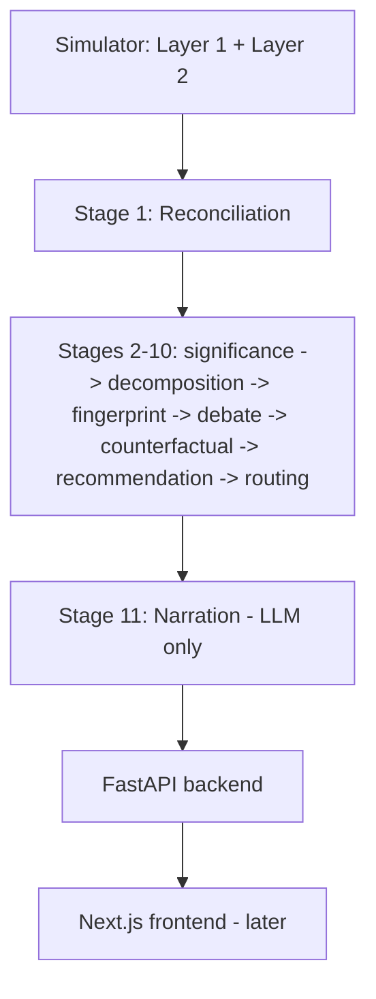

# PRD: PS3 — BusinessIntelligence.ai

## Summary

A KPI storytelling / root-cause diagnostic engine for AIC 2026's BusinessIntelligence.ai track (PS3). Given a KPI that moved, the system: detects whether the movement is actually significant, reconciles the data behind it across messy heterogeneous sources, decomposes and fingerprints the likely cause, debates competing hypotheses against real evidence, quantifies the counterfactual, and narrates a persona-specific, action-grounded recommendation — with the explicit ability to say **"normal variation, no story"** instead of manufacturing a plausible-sounding cause. Full detail: `docs/00-brief-and-topology/round2-topology-and-brief.md`.

## Principles

1. **The LLM is never the source of quantitative truth.** It narrates decisions already made by trained models or deterministic logic — never decides significance, cause, or ranking itself.
2. **Decline over false confidence.** An unresolved conflict, an unfillable gap, or genuinely noisy data should surface as an explicit "unresolved / normal" state, not a forced answer.
3. **Declare, don't infer, what can be declared.** Source bias, definitions, calendar convention — authored once at design time (the Semantic Contract), not re-derived live on every run.
4. **Materiality-gated action.** Never resolve, recompute, or rank based on whether a number moved — only on whether a *decision* would flip.
5. **Ground everything in real data.** The simulator is bootstrapped off the real Olist e-commerce dataset, not hand-tuned distributions — see `.claude/reference/database.md`.

## Users

| User | Goal | Pain |
|---|---|---|
| Executive persona | Fast, confident read on "is this a real problem and what do I do" | Drowning in dashboards that show *what* moved but not *why*, or worse, confidently wrong stories |
| Analyst persona | Deep, evidence-traceable investigation — which features/evidence drove the call | Manually reconciling conflicting numbers across CRM/billing/marketing before even starting the actual analysis |

## MVP Scope

**In (per the brief's minimum prototype checklist):**
- 3–5 KPIs across 2–3 sources (delivered: revenue, orders, AOV, active customers across `billing_system`, `crm_system`, `marketing_system`)
- A KPI semantic contract (declared source metadata — grain, cadence, definitions, bias direction)
- 2+ personas with genuinely different narratives/actions, not just more/less detail
- Specific test scenarios with known ground truth (the simulator's injected events)
- An LLM-vs-non-LLM cost/call breakdown
- Runtime telemetry

**Out (explicit scope guard, from the architecture report):**
- All 8 PRD decomposition dimensions — pick 2–3 (geography, product, segment) and go deep instead
- Deep learning anywhere in the pipeline — classical ML (logistic regression, LightGBM/XGBoost) is enough at this data scale and avoids overfitting/debugging risk
- Real-time external data sources (economic indicators, market data) — roadmap item only
- Sub-day timezone-cutoff calendar misalignment — Layer 1's atomic grain is whole-day, not timestamped (explicit, documented limitation, not silently skipped)
- Late-arriving/mutable-history reconciliation (Stage 1 scenario 3) — needs a Layer 1 schema extension (`returned_day_offset`) not yet built; documented as deferred, not faked

## Requirements

The 8 graded Round 2 objectives (paraphrased from the brief — full list in `docs/00-brief-and-topology/round2-topology-and-brief.md` §1):
1. Detect and prioritize material KPI movement
2. Reconcile heterogeneous data sources
3. Rank likely drivers/causes
4. Generate persona-specific narratives
5. Communicate uncertainty / be able to abstain
6. Recommend actions grounded in levers and decision rights
7. Learn from analyst/business-user feedback
8. Operate within security, cost, latency, and scalability constraints

10 real-world complexities the brief grades against: multiple interacting drivers; mismatched refresh cadences/grains; inconsistent KPI definitions/hierarchies/calendars; sparse history; materiality; contradictory evidence; role-based personalization; row/column-level security; model drift; LLM economics.

## Architecture

See `.claude/reference/architecture.md` for the full 11-stage + 7-cross-cutting-service map and current build status.

## Success Metrics

Per the architecture report §9 (the differentiator slide — no other team building this PS will have ground truth to score against):
- Anomaly detection precision/recall (Component A / Stage 2)
- Root-cause top-1 / top-3 accuracy (Component B / Stage 5a)
- **False-causality rate on noise episodes** — how often the system tells a confident story for an episode that was actually noise. The headline "ability to decline" metric.
- Counterfactual MAE vs. the simulator's true injected counterfactual (Stage 8)
- Confidence calibration curve

## Roadmap

| Phase | Goal | Status |
|---|---|---|
| 0 | Simulator (Layer 1 ground truth + Layer 2 observed sources) | **Done** — 150 episodes live in Neon, 6 of 7 reconciliation scenarios represented |
| 1 | Stage 1 — Reconciliation & Ingestion | Design complete, implementation plan in `.claude/plans/stage1-reconciliation-ingestion.md`, not yet coded |
| 2 | Stage 2 — Significance Detection | Designed (parallel track), not yet coded |
| 3 | Stage 3 — Cross-KPI Correlation | Designed, not yet coded |
| 4 | Stage 4 — Dimensional Decomposition | Implementation plan ready, blocked on Stage 2's function interface |
| 5+ | Stages 5a–11 + cross-cutting services | Not yet designed |
| — | FastAPI backend wiring `/detect`, `/investigate/{kpi_id}`, `/counterfactual`, `/story/{id}` | Not started |
| — | Next.js frontend (Executive Dashboard, Analyst View, drill-down chat) | Not started |
