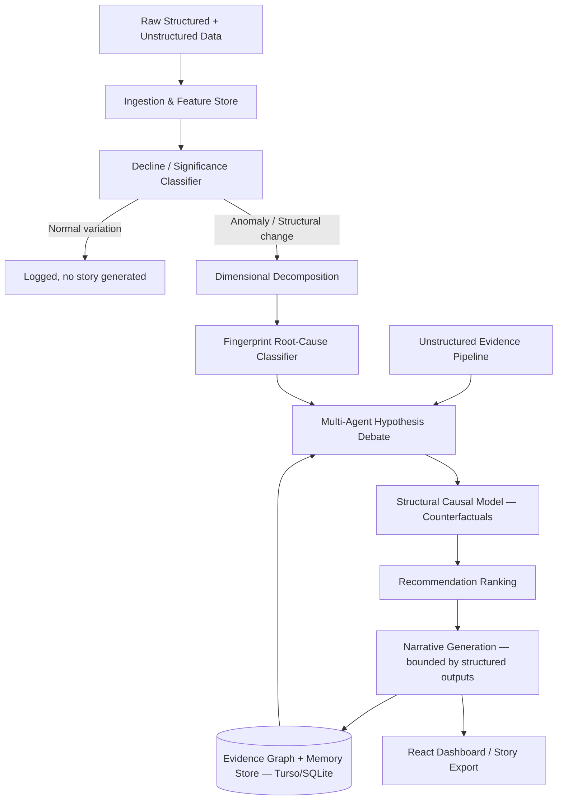
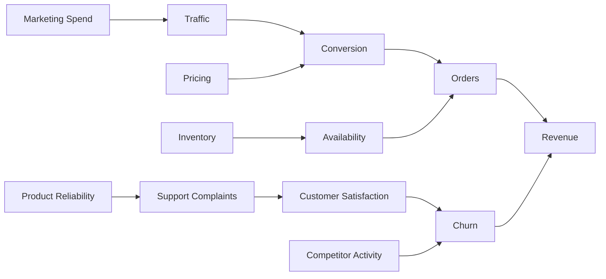
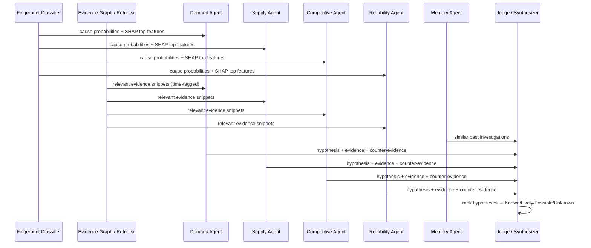

# PS3 — BusinessIntelligence.ai
## Differentiated System Architecture & Training Report

**Positioning:** the common failure mode for this PS is "decompose with pandas → RAG over docs → prompt an LLM to write the story." That's plumbing, not ML, and every team converges there. This architecture keeps the LLM at exactly one place — final narration — and puts trained models everywhere a judgment call actually happens: is this real, what caused it, what would've happened otherwise. Everything is trainable and evaluable because it's grounded in a synthetic simulator with known ground truth, which doubles as your eval framework (Section 9) — the slide competitor teams can't produce.

---

## 1. System Overview



The load-bearing design decision: **the LLM only runs after every number, hypothesis rank, and confidence label already exists.** Its job is to turn a structured object into prose, not to decide what's true. This is what lets you claim "evidence-backed" honestly instead of as a slide adjective.

Five components carry the actual differentiation:

| # | Component | Replaces the "common" version | Section |
|---|---|---|---|
| A | Decline/Significance Classifier | "ask the LLM if this looks unusual" | 3 |
| B | Fingerprint Root-Cause Classifier | "ask the LLM to guess the cause" | 4 |
| C | Structural Causal Model | "ask the LLM for a counterfactual" | 5 |
| D | Multi-Agent Debate (grounded) | "one LLM call brainstorming freely" | 6 |
| E | Evidence Pipeline (embeddings+NER) | "dump docs into a RAG prompt" | 7 |

---

## 2. Data Foundation — Synthetic Simulator

You need ground truth to train A and B and to evaluate everything, and there is no public dataset with labeled "this revenue drop was caused by X." So the simulator isn't a fallback — it's the thing that makes the ML claims true.

**Entities:** customers, products, orders, marketing campaigns, inventory, support tickets, CRM notes, reviews — matches PRD §24 directly.

**Structural equations** (the DAG in Section 5, but as actual generating functions, not just a diagram):
- `traffic = f(marketing_spend, seasonality, noise)`
- `conversion = f(traffic_quality, pricing, product_reliability, noise)`
- `orders = conversion × traffic`
- `revenue = orders × avg_order_value`
- `churn = f(support_complaints, satisfaction, competitor_activity, noise)`

**Injected causal events**, each with a known label and timestamp — this label is what you train on and what you score against later:
- Product outage → support tickets spike → satisfaction drops → churn rises → revenue falls (delayed, ramping onset)
- Marketing cut → traffic drops → orders drop → revenue falls (immediate, broad-based onset)
- Competitor launch → enterprise churn rises → revenue falls, concentrated in one segment
- Inventory shortage → availability drops → orders drop, concentrated in specific SKUs
- Pure noise episodes: revenue moves within normal variance, **no injected cause** — these are what train and test your "ability to decline" behavior

Generate several hundred episodes (a few days of Python — one team member's whole Day 1). Support tickets, CRM notes, and reviews are templated text with light randomization, so Component E has real (if synthetic) unstructured signal to chew on.

**Hybrid enrichment (optional polish):** overlay injected shocks onto a real dataset — Olist (Brazilian e-commerce, real order + review text) is the best fit since its reviews are messy real text, unlike anything you'll template. You still control the ground truth because you're injecting the shock yourself; the text just reads less synthetic in the demo.

**Storage:** everything lands in Turso/SQLite — `orders`, `customers`, `products`, `support_tickets`, `crm_notes`, `injected_events` (ground truth, held out from model inputs, used only in Section 9).

---

## 3. Component A — Decline / Significance Classifier

**Purpose:** decide Normal / Emerging / Significant / Structural (PRD §5) with a calibrated model instead of an LLM opinion.

**Pipeline:**
1. STL decomposition or changepoint detection (`ruptures` library, PELT or CUSUM) on the KPI time series → get residual, trend, changepoint location.
2. Extract features from the residual around the candidate changepoint.
3. Classify.

**Features:**

| Feature | What it captures |
|---|---|
| z-score of latest value vs historical std | Raw magnitude |
| Persistence (days the deviation holds above threshold) | Blip vs sustained |
| Forecast-interval breach (how far outside expected range) | Statistical unusualness |
| Cross-segment consistency (fraction of segments showing the same direction) | Broad-based vs isolated |
| Day-of-week deviation from seasonal baseline | Seasonality already explains it? |

**Model:** logistic regression as baseline, gradient-boosted trees (LightGBM) if the simple version underperforms — with a dataset this size (few hundred episodes) don't reach for anything heavier. Calibrate output probabilities (Platt scaling) because the confidence number is the product feature, not just the class label.

**Training:** simulator generates labeled episodes (including the pure-noise ones) → extract features → stratified train/val/test split → train → calibrate.

**Eval:** precision/recall per class, calibration curve, and — the metric that matters most for your differentiator — **false-causality rate**: how often the pipeline generates a confident story for an episode that was actually noise. This is a real, reportable number.

---

## 4. Component B — Fingerprint Root-Cause Classifier

This is your own idea, formalized as a trainable model rather than a heuristic.

**Feature vector** (the "signature"):

| Feature | Formula / definition |
|---|---|
| Visits delta | % change in traffic/visits vs baseline |
| Spend-per-visit delta | % change in average order value or conversion value |
| Product spread (entropy) | Shannon entropy of revenue share across SKUs — low = concentrated (product-specific), high = broad (macro cause) |
| Geo spread (entropy) | Same, across regions |
| Onset shape | Ratio of day-1 change magnitude to day-7 cumulative change — high ratio = step/shock, low ratio = ramp |
| Duration | Days since changepoint the deviation has persisted |
| Day-of-week profile shift | Cosine similarity between current and historical day-of-week revenue pattern |
| Channel mix shift | Change in revenue share across acquisition channels |

**Label space:** cause categories from PRD §8 — churn, marketing reduction, product reliability, inventory shortage, competitor activity, pricing change, seasonal, regional economic.

**Model:** multiclass gradient-boosted trees (XGBoost). Pull SHAP values per prediction — this isn't decoration, it's what feeds the debate agents in Section 6 and what satisfies the evidence-traceability requirement (PRD §19): "the model weighted geo-spread entropy and onset-shape most heavily" is a real explanation, not an LLM post-hoc rationalization.

**Training:** same simulator episodes, now with the injected cause as the multiclass label. Train/val/test split, stratified by cause type since classes may be imbalanced.

**Eval:** top-1 and top-3 accuracy, confusion matrix (which causes get confused with which — e.g. marketing-cut vs seasonal-dip both look broad-based and gradual, which is itself an interesting finding to show judges), SHAP fidelity spot-check.

---

## 5. Component C — Structural Causal Model (Counterfactuals)



**Approach:** each edge is its own fitted model (linear or light gradient-boosting regression), fit on simulator data — not hardcoded from the generating equations, since the point is to test whether the *inferred* structure recovers the *true* structure.

**Counterfactual procedure** (Pearl's abduction–action–prediction, in plain terms):
1. **Abduction** — for the specific observed episode, back out the residual noise at each node (what the fitted model didn't explain).
2. **Action** — set the intervened node (e.g. marketing spend) to its counterfactual value.
3. **Prediction** — propagate forward through the fitted edges, keeping each node's inferred residual fixed.

Answers "what would revenue have been without the churn increase" with an actual number and an interval, not a paragraph.

**Uncertainty:** bootstrap or residual resampling to produce an interval, not a point estimate — and when an edge's fit is weak (low R²), the system should say so explicitly rather than propagate a confident number through a shaky link. This is what makes ambiguity (PRD §17) a real behavior instead of a canned disclaimer.

---

## 6. Component D — Multi-Agent Hypothesis Debate

Direct reuse of your Board That Remembers structure, remapped to cause families instead of Skeptic/Growth/Finance:



**The critical constraint:** each agent is seeded with the fingerprint classifier's probability for its cause family plus the SHAP features that drove it plus retrieved evidence — never a blank prompt to "brainstorm why revenue fell." This is the difference between debate-as-decoration and debate-as-mechanism: agents are arguing over model output and retrieved evidence, so a hallucinated story has nothing to attach to. The Judge node produces the ranked hypothesis list with the Known/Likely/Possible/Unknown buckets from PRD §17, plus what additional evidence would resolve the ambiguity.

Memory agent queries Turso for prior investigations with similar fingerprints — same pattern as Board That Remembers' commitment-tracking, applied to "we've seen this signature before."

---

## 7. Component E — Unstructured Evidence Pipeline

| Stage | Tool | Why |
|---|---|---|
| Chunking + embedding | `sentence-transformers` (MiniLM) | Local, fast, free — no API cost during a hackathon demo |
| Vector store | `sqlite-vec` extension on Turso, or in-memory FAISS if time-constrained | Keeps you on your existing stack |
| Entity extraction | spaCy (`en_core_web_sm`) | Cheap NER for customer/product/region mentions |
| Sentiment | VADER or a small DistilBERT sentiment model | Lightweight, no training needed |

Extracted entities link into the evidence graph tables (Customer, Product, Region, Event, Issue — PRD §10), each tagged **before / during / after** the KPI changepoint (PRD §12) — this temporal tag is what stops the system from mistaking a consequence for a cause, and it's a cheap rule to implement (compare event timestamp to changepoint date) that most teams will skip.

At debate time, agents retrieve only evidence filtered to their entity scope and the relevant time window — not a generic RAG dump.

---

## 8. Orchestration & Serving

- **LangGraph** graph = the flowchart in Section 1 as literal nodes, with a conditional edge after Component A: if classified "normal variation," skip straight to logging, don't waste an LLM call on a non-story.
- **FastAPI** endpoints map to product-loop stages: `/detect`, `/investigate/{kpi_id}`, `/counterfactual`, `/story/{id}`.
- **Turso/SQLite** holds: raw simulator/hybrid data, evidence graph, investigation history (Memory agent's source), and the trained model artifacts' metadata.
- **React** frontend: Executive Dashboard (PRD §27), Analyst View exposing the fingerprint SHAP breakdown and SCM edge fits (PRD §28), and the interactive drill-down chat (PRD §18). Story export can reuse your WeasyPrint PDF pipeline from the PRDs, so the final artifact matches your existing visual identity.

---

## 9. Training & Evaluation Loop (your best demo slide)

```
Simulator → labeled episodes → train/val/test split
  → train Component A (significance) and Component B (fingerprint)
  → freeze models
  → run the FULL pipeline end-to-end on held-out episodes
  → compare system output vs simulator's injected ground truth
```

| Metric | What it proves |
|---|---|
| Anomaly detection precision/recall | Component A works |
| Root-cause top-1 / top-3 accuracy | Component B works |
| False-causality rate on noise episodes | The "ability to decline" differentiator, quantified |
| Counterfactual MAE vs true simulated counterfactual | Component C isn't hand-waving |
| Confidence calibration curve | "How certain are we" (PRD §17) is honest, not decorative |

No other team building this PS will have ground truth to score against, because building the simulator is optional busywork from their point of view. For you it's the foundation the whole pitch stands on — and it's a live confusion matrix you can show, not a claim.

---

## 10. Phased Build Plan

| Phase | Deliverable | Rough split |
|---|---|---|
| 1 | Simulator + injected events + Turso schema | 1 person, ~1 day |
| 2 | Component A + B: features, training, eval notebook | 1 person (ML-leaning) |
| 3 | LangGraph orchestration + Component D agents + Component E pipeline | 1 person (backend-leaning) |
| 4 | Component C (SCM) + counterfactual endpoint | Whoever's free after Phase 2 |
| 5 | React dashboard + interactive chat + story PDF export | Parallel, once `/story` endpoint is stable |
| 6 | End-to-end eval run + polish the Section 9 metrics for the deck | Whole team |

Phases 2–4 can run in parallel once the simulator (Phase 1) exists, since they all consume the same synthetic data.

---

## 11. Scope Guard — What NOT to Build

Same discipline as your city-scoping and unobservable-parameter-ranges calls:

- **Don't** try to cover all eight PRD decomposition dimensions (§6) — pick 2–3 (geography, product, segment) and go deep.
- **Don't** reach for deep learning anywhere — every model above is trainable on a few hundred synthetic episodes; a neural net would just overfit and cost you debugging time you don't have.
- **Don't** try to integrate real-time external data sources (economic indicators, market data, PRD §23) — mention them as a roadmap item in the deck, don't build the ingestion.
- **Don't** let the LLM touch anything upstream of narration — the moment it's deciding significance or ranking causes instead of describing them, you've collapsed back into the common submission.
