# Stage 0 — Simulator Database & Schema Design

**Status:** Implemented — schema is live as [`pipeline/simulator/layer1_ground_truth/schema.sql`](../../pipeline/simulator/layer1_ground_truth/schema.sql), a shared **Postgres** database hosted on **Neon** (not SQLite — the team collaborates against one live instance from day 1 instead of everyone generating a local file). This doc is the rationale + ER diagram; `schema.sql` is the canonical, executable DDL — if the two ever disagree, the `.sql` file is right. Builds directly on [`simulator-layer1-ground-truth-design.md`](simulator-layer1-ground-truth-design.md); read that first for the *why*.

Called "Stage 0" because every other stage depends on this existing first — it's not one of the 11 pipeline stages, it's what they all read from (via Layer 2, never directly).

---

## 1. ER overview

```mermaid
erDiagram
    episodes ||--o{ customers : has
    episodes ||--o{ products : has
    episodes ||--o{ daily_state : has
    episodes ||--o{ orders : has
    episodes ||--o{ support_tickets : has
    episodes ||--o{ injected_events : has
    injected_events |o--o{ injected_events : triggers
    customers ||--o{ orders : places
    customers ||--o{ support_tickets : files
    products ||--o{ orders : "ordered as"
    products ||--o| injected_events : "affected (optional)"
```



Everything hangs off `episode_id` — an episode is a fully independent fake business, so nothing joins across episodes except by explicit design (e.g. training a model on all of them at once).

## 2. Tables

Full DDL lives in [`schema.sql`](../../pipeline/simulator/layer1_ground_truth/schema.sql) — not duplicated here so the two can't drift apart (the exact bug class this whole system exists to catch elsewhere). Summary, 7 tables:

| Table | Grain | Holds |
|---|---|---|
| `episodes` | 1 row / episode | seed, day count, start date |
| `customers` | 1 row / customer | segment (ours), region (Olist state), signup/churn day offsets |
| `products` | 1 row / product | category, cost, price (Olist-bootstrapped) |
| `daily_state` | 1 row / episode / day | latent driving variables + `volatility_multiplier` (§3a of design doc) |
| `orders` | 1 row / order | atomic transaction — revenue/AOV/orders-count are derived from this, never stored |
| `support_tickets` | 1 row / ticket | atomic complaint — feeds `daily_state.satisfaction` |
| `injected_events` | 0–N rows / episode | **the answer key**, held out; severity, onset shape, mitigation, segment skew, optional `triggered_by_event_id` self-FK for reactive chaining |

## 3. How a KPI actually comes out of this (worked example)

Nothing named `revenue` or `active_customers` is stored anywhere — they're queries. Using Episode #1 from the walkthrough:

```sql
-- Daily revenue + order count for one episode
SELECT day_offset, SUM(quantity * unit_price) AS revenue, COUNT(*) AS orders_count
FROM orders
WHERE episode_id = 1
GROUP BY day_offset
ORDER BY day_offset;

-- Active customers as of a given day
SELECT COUNT(*) FROM customers
WHERE episode_id = 1
  AND signup_day_offset <= 45
  AND (churned_day_offset IS NULL OR churned_day_offset > 45);
```

This is deliberate: it's the same "one atomic truth, bucket on demand" principle Stage 1's design already commits to for the Calendar Dimension — applying it here means Layer 2's degradation views have real transactional rows to re-aggregate differently (weekly vs daily, by segment, by SKU), not a pre-computed number they'd have to fight to un-aggregate.

## 4. What's deliberately not a table here

- **No `regions` / `product_categories` / `ticket_categories` lookup tables** — `region`/`category` values are drawn from real Olist categories (see §4a), but stored as plain `TEXT` here rather than a normalized lookup table. Add a real lookup table only if the category list needs to grow dynamically per source (it doesn't, yet).
- **No stored `revenue` / `active_customers` / `orders_count` columns** — see §3. Storing these would let them silently drift from the atomic rows, which is exactly the bug class Stage 1 exists to catch in *real* fragmented systems; Layer 1 shouldn't manufacture that bug itself.
- **KPI Semantic Contract, Calendar Dimension, Identity Resolution Graph** — real tables, but they're *Stage 1's* schema (declared per-source metadata, calendar bucketing rules, record-linkage scores), not Layer 1's. They get designed when Stage 1 is implemented, not here — Layer 1 has no sources yet, only one perfect truth.
- **No `olist_*` raw tables in this database** — Olist is a bootstrap *source* consulted at generation time (sampled from the downloaded Olist CSVs directly in the generator script), not copied wholesale into this schema. This DB only ever holds the (possibly Olist-inspired) fake episode, never real Olist rows verbatim.
- **CRM notes / review text tables** — belongs with Stage 6 (evidence pipeline). Layer 1 ships the numeric substrate first, keyed so Olist review text can be joined on later without a rewrite.

## 4a. Real-data grounding — Olist as bootstrap source

Per the design doc §1.1, customer regions, product categories/prices, order-timing seasonality, and delivery-slippage baselines are **bootstrap-resampled from the real Olist dataset** at generation time rather than hand-authored gaussians — so a "boring normal day" in this database already has real-world lumpiness (real geographic concentration, real long-tailed prices, real calendar effects) before any event is ever injected.

## 5. Next step

Write the generator script against the live Neon database: `pipeline/simulator/layer1_ground_truth/generate.py` (or similar), inserting rows via `DATABASE_URL`, following the day-by-day generation order already specified in §3 of the Layer 1 design doc.
