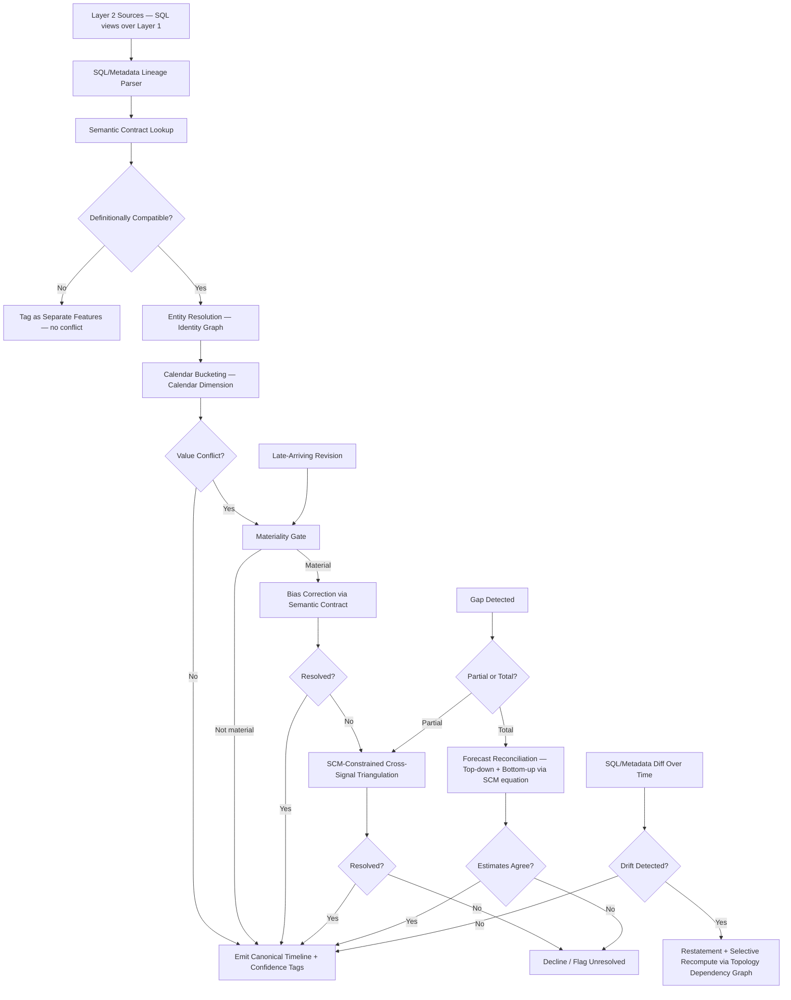

# Stage 1 — Data Reconciliation & Ingestion
## Design Report — PS3 BusinessIntelligence.ai, Round 2 (AIC 2026)

**Status:** Design complete, pre-implementation. Nothing coded yet — this is the architecture and rationale so any team member can build from it without re-deriving the reasoning.

**Team credit:** The core proposals in each scenario below came from Minhaj; this document formalizes them, names the underlying techniques where a real established method exists, and tightens edge cases. Where a proposal was amended, both the original instinct and the amendment are recorded so the team can consciously accept or override the change.

---

## 1. Purpose & Scope

Stage 1 is the first stage of the 11-stage pipeline. Its job: take data from heterogeneous, imperfect sources — different grains, different cadences, different definitions, sometimes missing or conflicting — and produce a single, trustworthy, uncertainty-tagged timeline that every downstream stage (significance detection, decomposition, fingerprinting, evidence retrieval) can rely on without re-checking data quality itself.

This stage directly answers graded Round 2 requirements: "reconciles data and business context across heterogeneous sources," and the real-world complexity list's "different source-system refresh cadences, grains, data quality levels," "inconsistent KPI definitions, hierarchies, calendars," and part of "LLM economics" (Stage 1 does no LLM calls at all — everything here is deterministic/statistical).

---

## 2. The Simulator — Two Layers

The team started at ideation with only a single-KPI, single-truth simulator (per the original architecture report). Stage 1's scenarios only exist if a second, deliberately messier layer sits on top of that truth. The simulator is therefore split into two layers:

### Layer 1 — Ground Truth
A generative engine, run once, that simulates a fake business over time using structural equations (already sketched in the original report: `traffic = f(marketing_spend, seasonality, noise)`, `revenue = orders × avg_order_value`, `churn = f(support_complaints, satisfaction, competitor_activity, noise)`, etc.), extended to drive **multiple related KPIs simultaneously** (revenue, active customers, conversion, orders — not just revenue alone). Known causal events are injected at known timestamps. This layer is perfect, atomic-grain, and complete. It is held out from the pipeline entirely and used only for scoring (Section 9 of the original architecture report).

### Layer 2 — Observed Sources
A deliberate *degradation layer* built as SQL views over Layer 1, simulating what real fragmented source systems would actually expose:
- Different grains (daily vs. weekly)
- Different cadences and reporting lag
- Different definitions of superficially-same concepts ("active customer" defined differently per source)
- Deliberately injected staleness, bias direction, missing windows, conflicting values, calendar convention differences, and duplicate/mismatched entity keys

Because Layer 2 sources are literal SQL views (not pre-baked static tables), Stage 1 can parse their defining query (`WHERE`, `JOIN`, `GROUP BY`/`DATE_TRUNC` clauses) to infer meaning, calendar convention, and later, drift — this is the mechanism behind several scenarios below (identical technique to how tools like dbt/OpenLineage do column-level lineage).

**Key discipline:** Layer 1 answers "why did the KPI move" (Stages 4+). Layer 2's engineered messiness answers "how hard is it to even see what happened" (Stage 1). These are independent axes — a scenario can pair a clean single cause with messy sources, or a confounded cause with perfectly clean data.

---

## 3. Cross-Cutting Services Introduced or Extended by Stage 1

These are not pipeline stages — they are shared reference services consulted by Stage 1 and reused by later stages.

### 3.1 KPI Semantic Contract (extended)
Per-source declared metadata, authored by the team at simulator-build time (not inferred live):
- Grain, cadence, reporting lag
- Plain-language definition of what the field measures
- Known bias direction (e.g., "CRM active-customer count tends to overcount due to manual-update lag")
- Calendar convention (week-start day, timezone cutoff, fiscal vs. calendar)
- Classification rules/thresholds where applicable (e.g., what revenue threshold defines "Enterprise")

This is deliberately *declared*, not discovered by the model at runtime — mirroring how real data-governance tools (Collibra, Alation) maintain trust/definition metadata per source.

### 3.2 Calendar Dimension (new shared reference table)
A single shared table that can bucket any raw, atomic-grain timestamp into any calendar convention in play (Gregorian week, fiscal week, billing-cycle month, UTC day, local-timezone day). Because Layer 1 is atomic-grain and owned by the team, re-bucketing on demand from raw truth is **exact** — this avoids materializing and maintaining N separately-drifting pre-aggregated versions of the same KPI.

### 3.3 Identity Resolution Graph (new cross-cutting service)
The one genuinely new component to come out of Stage 1 design (everything else reused existing machinery). A probabilistic record-linkage service (Fellegi-Sunter model — the same approach used in real Master Data Management tools like Informatica MDM) that resolves whether records across sources (CRM customer ID, billing ID, email, support-ticket account name) refer to the same real-world entity. Consulted by Stage 1 (to reconcile source records) and Stage 6 (evidence retrieval — linking CRM notes/tickets to the correct account).

---

## 4. The Seven Reconciliation Scenarios

### Scenario 1 — Conflicting Values Across Sources
**Problem:** Two sources report different numbers for what claims to be the same fact (e.g., CRM says 500 active accounts, billing says 480).

**Final design (escalation order):**
1. **Definitional compatibility check** — confirm both sources are actually measuring the same construct before comparing at all (this frequently dissolves the "conflict" entirely — see Scenario 2).
2. **Materiality gate** — if compatible, check whether the discrepancy could actually change a downstream decision (a significance call, a hypothesis ranking). If not material, pass the average/either value through silently.
3. **Config-driven bias correction** — consult the Semantic Contract's declared bias-direction metadata per source and adjust or select accordingly (no live inference needed — this is precisely why bias direction is *declared*, not derived).
4. **Cross-signal triangulation** — only if step 3 has no confident profile: check which *other* metrics correlate with the disputed value. Candidates for triangulation are constrained to metrics 1–2 hops away in the Structural Causal Model's DAG (Component C) — never a blind scan across all 30–50 KPIs, which invites spurious correlations (classic multiple-comparisons problem at small sample sizes).
5. **Spread-size fork:**
   - *Small spread* → take the midpoint (strictly safer than picking an arbitrary endpoint, free to do).
   - *Large spread* → do **not** average. First check for a unit/scale mismatch or timing mismatch (most common real cause of 10x+ gaps), then check each value against that metric's own historical plausibility range. If a value is implausible on its face, treat it as likely-erroneous, not as the low end of an honest range.
6. **Unresolved + material** → decline. Route to the abstention mechanism (reused from Stage 2's "ability to decline" philosophy) rather than propagate a range wide enough to make downstream numbers meaningless.

**Reused machinery:** Semantic Contract, SCM/DAG, materiality gate, sampled-range-for-uncertainty principle, abstention mechanism.

---

### Scenario 2 — Definitional Mismatch
**Problem:** Same column name, same apparent metric, genuinely different meaning (CRM's "active" = logged in last 30 days; billing's "active" = purchased last 30 days).

**Final design (escalation order):**
1. **Rename to semantically precise labels** at the point the Semantic Contract is authored (`crm.active_customers_30d_logged_in`, `billing.active_customers_30d_purchased`) — this is a design-time declaration, not a runtime inference, and dissolves the apparent conflict immediately.
2. **Mechanism for detecting this automatically where possible:** parse the defining SQL/view's `WHERE` clause (Layer 2 sources are literal SQL views over Layer 1) to infer the actual filter condition — the same lineage-reading technique real tools (dbt, OpenLineage) use for column-level lineage.
3. **Escalation ladder when SQL/metadata is ambiguous:** documentation/metadata match → SQL/transformation lineage inference → human-in-loop, one-time.
4. **Human-in-loop constraint:** cannot be a live runtime dependency (can't pause a demo for a person). Any human resolution is written **once** into the Semantic Contract via the Learning & Memory service — the next comparison never asks again. This directly satisfies graded requirement #7 ("mechanism to learn from analyst and business-user feedback").
5. **After disambiguation:** the two metrics are kept as **separate features**, not collapsed into one "official" number — the divergence itself (logged-in-but-not-purchasing) is a potentially meaningful signal, not noise to discard.

**Reused machinery:** Same escalation-ladder shape as Scenario 1; Semantic Contract; Learning & Memory service.

---

### Scenario 3 — Late-Arriving / Mutable History
**Problem:** A source revises a past value after the fact (a refund posts late, a corrected invoice replaces an old one) — potentially after a diagnosis based on the old value has already been delivered to a stakeholder.

**Final design:**
1. **Version every diagnosis**, never overwrite.
2. **Dependency-aware selective recompute:** when revised data arrives, walk forward through the 11-stage topology's own dependency graph and only re-trigger stages that actually consume the changed data slice — reusing the topology as the recompute graph rather than building a second dependency system.
3. **Materiality gate before recompute** — trigger only if the revision would flip a decision (a significance verdict, a top-ranked hypothesis), not merely move a number (same gate as Scenario 1).
4. **Restatement, not silent versioning:** when a materially different diagnosis results, it must surface as a visible, dated correction — "Diagnosis v2 supersedes v1 — reason: revenue data for [dates] revised on [date]" — modeled on financial-statement restatement practice, not a quietly incremented version number. The original recommendation's owner (Decision Rights) is explicitly notified.
5. **Cutoff guardrail:** data older than N days does not trigger recompute even if revised, to prevent infinite churn from trickling corrections.

**Forward-looking extension (provisional data):** the same lifecycle applies pre-emptively. Data inside a known resolution window (e.g., revenue still inside an open refund window) is tagged `provisional` with a resolution date and worst-case magnitude at Stage 1 (declaration only, no computation) — modeled on accounting's refund-reserve/contingent-liability concept. Stage 8 (counterfactual engine) can be pointed at the question "what if this resolves unfavorably" using existing machinery, and Stage 9's recommendation can output a soft `monitor — do not act` action with a monitoring plan set to the resolution date, using the existing recommendation-structure slot. This is the forward-looking twin of restatement: restatement corrects after the ground shifts, this warns before it might.

**Reused machinery:** Topology-as-dependency-graph, materiality gate, Decision Rights, Stage 8 counterfactual engine, Stage 9 recommendation structure.

---

### Scenario 4 — True Gaps vs. Estimable Gaps
**Problem:** A source reports nothing at all for a period (outage, missed batch job) — distinct from low-resolution data; this is *zero* data.

**Final design — two sub-cases:**

**Partial gap** (one field missing, correlated same-date fields present): use cross-signal regression constrained to the SCM's causally-connected neighbors (same triangulation approach as Scenario 1) to estimate the missing field.

**Total gap** (every metric missing for the period — nothing to correlate against): use **hierarchical forecast reconciliation** (Hyndman et al. — the method behind the `hts`/`fable` forecasting libraries):
1. Top-down estimate: extrapolate the target KPI's own trend/seasonality directly (reusing Stage 2's STL/changepoint decomposition as a forecaster instead of a detector).
2. Bottom-up estimate: extrapolate each structurally-related leaf variable (orders, AOV) independently using the same trend engine, then recompose via the SCM's actual structural equation (`revenue = orders × avg_order_value`) — not a generic weighted sum, which would discard the one piece of real ground truth already available.
3. Compare the two estimates. Agreement → combine, weighted by each method's own confidence (as in real reconciliation methods like MinT); mark high-confidence. Divergence → do not average through it; treat the disagreement itself as evidence that something structurally shifted inside the gap, sharply widen uncertainty, and push toward caution/abstention rather than a confident fill.
4. **Technical note:** because recomposition here is multiplicative, not additive, relative errors compound multiplicatively (approximately adding in quadrature) — narrower, naively-additive uncertainty bands would understate true risk.

**Danger-direction ruling:** "assume continuation" is the more dangerous default (manufactures false certainty and can paper over a real drop hiding in the gap); imputed values must carry visibly widened uncertainty into Stage 2's significance test, making the system *more* cautious around heavily-imputed windows, not silently confident.

**Fingerprint-confusion safeguard:** a true reporting outage and a true business event are distinguishable — an outage produces nulls across every correlated metric at once with a sharp mechanical on/off boundary; a real cause produces value changes, not missing rows, and rarely hits every metric identically. The imputation tag must survive into Stage 5a, which must discount confidence or decline to fingerprint a majority-imputed window rather than treat a filled guess as an observed shape.

**Reused machinery:** SCM-constrained triangulation, Stage 2's decomposition engine (third reuse), abstention mechanism, uncertainty propagation.

---

### Scenario 5 — Calendar Misalignment
**Problem:** Sources use the same words ("daily," "weekly") but different actual boundaries — week-start day, timezone cutoff, fiscal vs. calendar calendar, billing-cycle vs. calendar-month. This can distort onset shape (a sharp single-day drop can appear smeared across two weekly buckets if a boundary falls mid-event), directly threatening Stage 5a's fingerprint classification.

**Final design:**
- **Rejected approach:** materializing the same KPI under every possible convention (combinatorial storage growth, and creates N−1 new places for numbers to drift out of sync with each other — recreates the exact fragmentation problem Stage 1 exists to solve).
- **Adopted approach:** maintain exactly one atomic-grain, unambiguous-timestamp truth (Layer 1), plus the shared Calendar Dimension reference table (Section 3.2). Bucket into whatever convention is needed for a given comparison, on demand — exact, because it's a re-sum of raw rows, not a conversion of an aggregate.
- **Fallback (for real aggregated data without raw grain — e.g., the optional Olist hybrid-enrichment layer):** a unit/convention converter is needed, but this reduces to the same disaggregation problem and ladder as Scenario 1 (exact if available → correlated-indicator estimate → borrowed-analog shape), not new machinery.
- **Inference source:** the same SQL-lineage parsing built for Scenario 2 (reading `GROUP BY`/`DATE_TRUNC` clauses) can often recover a source's calendar convention automatically, falling back to the manually-declared Semantic Contract field when a source's query isn't exposed.

**Reused machinery:** Layer 1 atomic truth, Semantic Contract, Scenario 1's disaggregation ladder, SQL-lineage parsing.

---

### Scenario 6 — Entity / Join-Key Mismatch
**Problem:** Before values can be reconciled, records must be confirmed to refer to the same real-world entity. Different sources key on different identifiers (customer ID, email, billing ID, account name); duplicates and drift over time are possible.

**Final design:** **Probabilistic record linkage** (Fellegi-Sunter model) across multiple imperfect identifying fields (email, phone, name, address, company, customer ID, billing ID, device ID, transaction history), with:
- **Field weighting derived from rarity, not intuition:** weight = how surprising an agreement on that field would be by pure chance if the records were actually different people (an exact billing-ID match is strong evidence; a shared last name is weak). Weights can be estimated directly from the simulator's own generated population.
- **Two thresholds, three zones**, not one binary cutoff: high score → auto-merge; low score → auto-reject; ambiguous middle band → route to the same human-in-loop / abstention mechanism as Scenario 2, surfaced as "unresolved, needs confirmation" rather than forced either direction.
- **Error-direction ruling:** under-merging is the safer default for this PS. Under-merging loses one piece of evidence (visible, recoverable, flaggable). Over-merging silently contaminates the evidence pipeline with a wrong attribution that is indistinguishable downstream from a correct one — same "decline rather than propagate a shaky result" principle applied to identity instead of values.

**New component:** this is the one scenario that did not reduce to reusing existing machinery. It required standing up the **Identity Resolution Graph** (Section 3.3) as a genuinely new cross-cutting service, consulted by both Stage 1 (source reconciliation) and Stage 6 (evidence-to-entity linking).

---

### Scenario 7 — Silent Definitional Drift
**Problem:** A source quietly changes what it measures partway through the timeline with no schema change or announcement (attribution logic change, a segment threshold change such as the Enterprise revenue cutoff moving from $50k to $75k, a catalog re-categorization). Unlike Scenarios 1–6, this produces clean, complete, internally-consistent-looking data that means something different than before — the closest thing in Stage 1 to a genuinely hard-to-detect failure mode, because a resulting step-change can closely mimic the sharp, broad-based onset signature Stage 5a associates with a real cause like a marketing cut.

**Final design (four-level evidence ladder):**
1. **Direct evidence** — API documentation, segment/config rules, or a diff of the source's own SQL/analytics metadata over time (snapshot the SQL parsed in Scenario 2 and diff it across runs — a changed `WHERE`/`JOIN` condition is a hard, mechanical tell, even without knowing the business reason).
2. **Strong statistical evidence** — changepoint detection applied not to the KPI trend but to the *distribution of the underlying classifying attribute* against its threshold (e.g., the histogram of account revenue relative to the Enterprise cutoff) — reusing Stage 2's `ruptures`/STL machinery a third time, now for boundary-shift detection rather than trend detection or gap-filling.
3. **Weak aggregate-only trigger** — when account-level granularity isn't available: a sudden, isolated move in one KPI with **no corresponding movement in its causally-connected neighbors** (orders, conversion, support tickets on the same accounts, per the SCM/DAG) is a specific, meaningful red flag for "the label changed" rather than "the business changed" — sharper than magnitude alone, which a real shock could equally produce.
4. **Human-in-loop confirmation and threshold update** — same one-time-resolution pattern as Scenario 2, written into the Semantic Contract via Learning & Memory.

**Closing the loop:** once drift is confirmed at any level, the response reuses Scenario 3's machinery exactly — version the affected slice, restate the diagnosis, and selectively recompute only the portion of the topology downstream of the changed definition, rather than building new recompute logic for this case.

**Honest limitation to state in the report:** this scenario is a confidence-graded detection system, not a guaranteed one. Level 3 in particular is a trigger for suspicion, not proof. This should be stated plainly to judges rather than overclaimed.

**Reused machinery:** SQL-lineage diffing (Scenario 2), Stage 2's changepoint engine (fourth reuse), SCM/DAG neighbor-check, Scenario 3's restatement + selective recompute, Semantic Contract, Learning & Memory.

---

## 5. Recurring Design Principles (the actual differentiator of this stage)

Across all seven scenarios, only **one genuinely new component** was required (the Identity Resolution Graph) and **one new shared reference table** (the Calendar Dimension). Everything else was solved by repeatedly applying a small, named set of principles:

1. **Tiered confidence escalation** — cheap/deterministic checks first, expensive/human checks last, every tier tagging the confidence it actually achieved. Appears in: value conflicts, definitional mismatch, gap-filling, calendar disaggregation, entity resolution, drift detection.
2. **Materiality-gated action** — never resolve or recompute based on whether a number moved, only whether a *decision* would flip. Appears in: value conflicts, mutable history, drift detection.
3. **Causal-graph-constrained triangulation** — when corroborating evidence is needed, only consult metrics the SCM/DAG says are structurally connected; never blind-scan everything. Appears in: value conflicts, gap-filling, drift detection.
4. **Declare, don't infer, what can be declared** — source bias direction, definitions, and calendar convention are authored once into the Semantic Contract at design time; live inference (SQL-lineage parsing) is the fallback for sources that don't expose this. Appears in: nearly every scenario.
5. **Uncertainty that propagates and compounds** — an estimate's confidence tag must survive and appropriately widen through every downstream consumer, never getting "laundered" into false certainty.
6. **Decline over false confidence** — the same "ability to say nothing" philosophy from the top-level differentiator, reapplied one layer earlier: an unresolved conflict, an unfillable gap, or an ambiguous identity match should surface as an explicit unresolved state, not a forced answer.
7. **Correction has a name and an owner** — restatement, not silent overwrite; the original recommendation's owner is notified, borrowing directly from financial-restatement practice.

This is the honest headline for the report and the pitch: **the same handful of principles, applied consistently, is what makes this a coherent architecture rather than seven separate patches.**

---

## 6. Stage 1 Internal Pipeline (High-Level)

---

## 7. What Stage 1 Hands Downstream (Output Contract)

Every data point emitted by Stage 1 into Stage 2 carries, at minimum:
- **Value** (point estimate or range)
- **Confidence tier** (which escalation level resolved it — exact / aggregated / estimated / triangulated / declared-unresolved)
- **Source provenance** (which source(s) contributed, post entity-resolution)
- **Imputation flag** (untouched / partially imputed / fully imputed, and by which method)
- **Uncertainty width** (explicitly widened for imputed or triangulated values, compounded correctly for multiplicative recomposition)
- **Provisional flag + resolution date**, where applicable (refund windows, open billing cycles)
- **Version / restatement lineage**, where the value has been revised from a prior diagnosis run

This contract is what lets Stage 2's significance test, Stage 5a's fingerprinting, and Stage 8's counterfactuals treat a shaky, heavily-imputed number with appropriate caution rather than as an equally-trustworthy observation — the mechanism that makes "communicates uncertainty" (graded requirement #5) real rather than a slide claim.

---

## 8. Deferred / Known Limitations (to state honestly to judges)

- Silent definitional drift (Scenario 7) is a confidence-graded detection system, not a guarantee — Level 3 is a suspicion trigger, not proof.
- The Identity Resolution Graph's field-rarity weights, in a hackathon build, will be estimated from the simulator's own synthetic population rather than a real enterprise's identity distribution.
- Real external data sources (economic indicators, market data) remain explicitly out of scope, per the original architecture report's scope guard.

---
**Note on project docs:** this file and `claude/ps3-stage1-reconciliation-design.md` in the source Claude project are byte-identical (the same design report was saved to two paths). This copy is the canonical one for the local scaffold; no content was lost by deduplicating.
