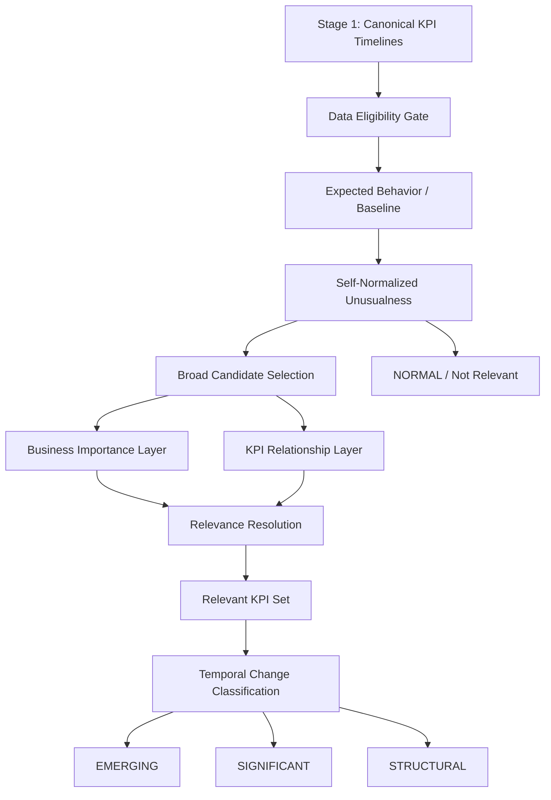
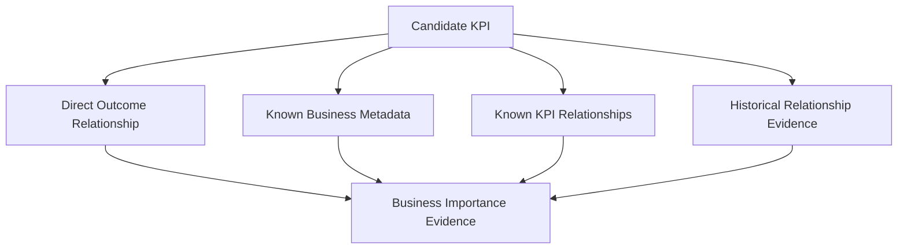
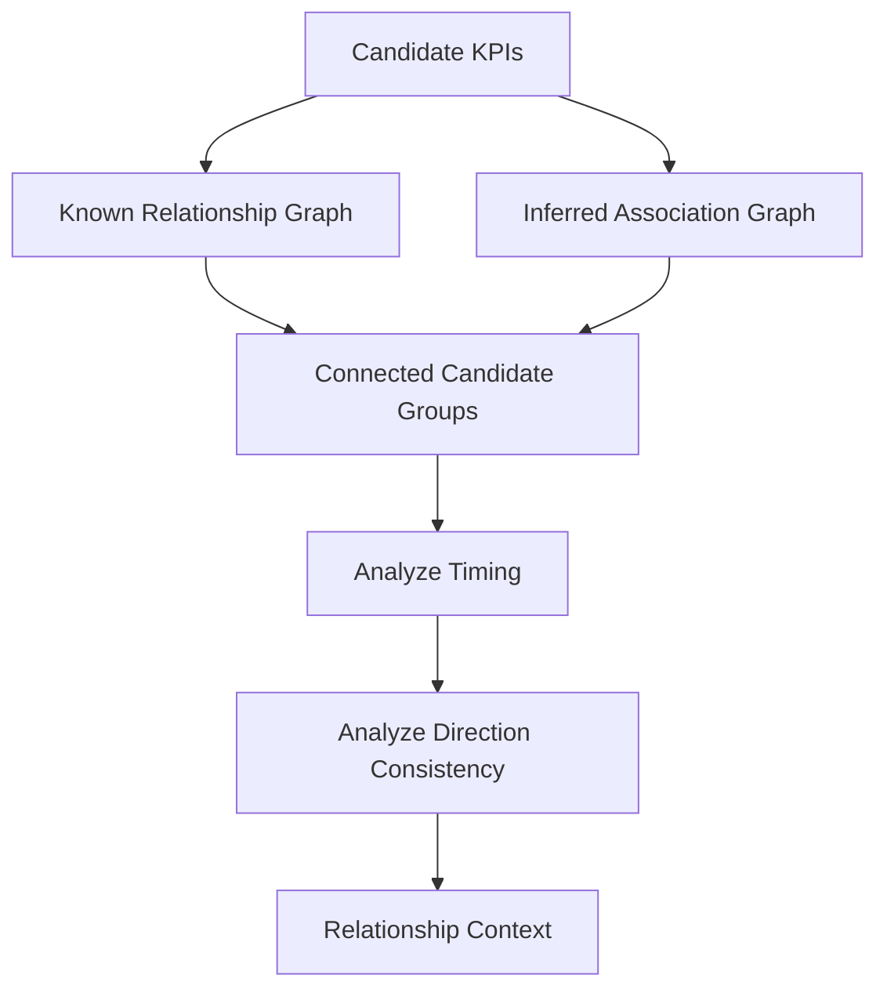
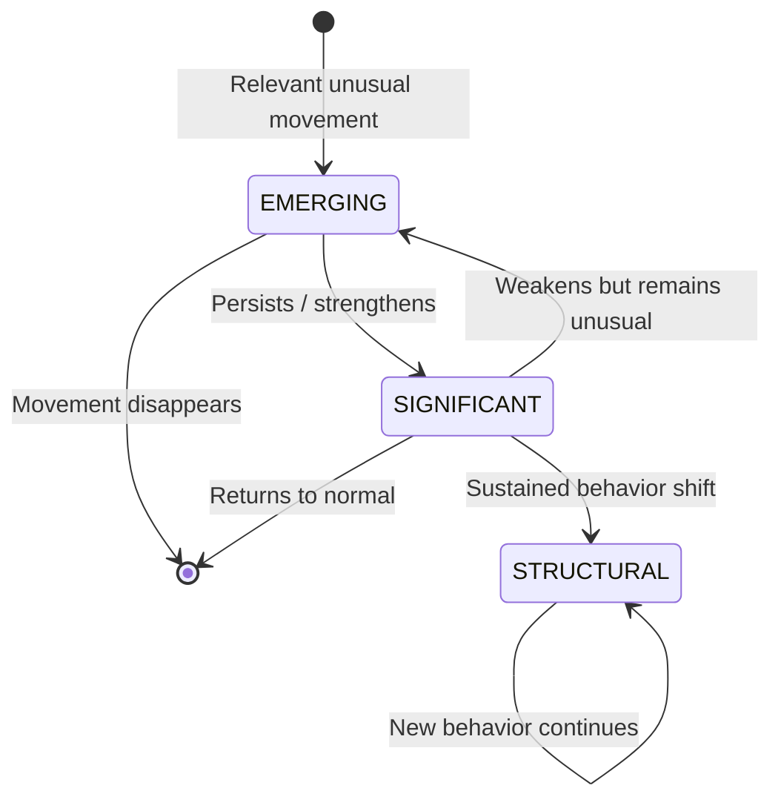
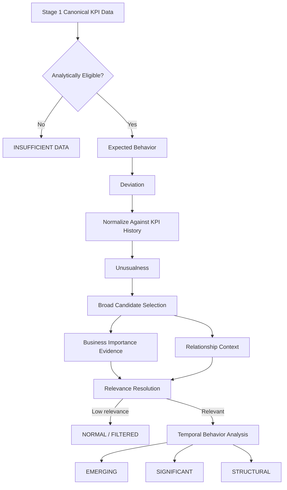

# Stage 2 — Relevant KPI Extraction and Change Classification

# Detailed Architecture

## 1. Purpose

Stage 2 has two separate responsibilities:

1. **Relevance extraction:** Which KPI movements are worth paying attention to?
2. **Change classification:** What kind of change is happening to each relevant KPI?

The output states are:

```text
EMERGING
SIGNIFICANT
STRUCTURAL
```

KPIs that are behaving normally, or whose unusual movement has insufficient relevance, are not escalated.

The key architectural principle is:

> **Do not use manually chosen percentage thresholds as the primary definition of significance for every KPI.**

Instead, Stage 2 first evaluates how unusual a movement is relative to the KPI's own history, then evaluates whether the KPI matters in the broader business context.

---

# 2. High-Level Architecture



The pipeline deliberately separates:

```text
Is this movement unusual?
```

from:

```text
Does this movement matter?
```

and then separates both from:

```text
What type of change is it?
```

---

# 3. Why This Architecture Is Better Than Fixed KPI Thresholds

A fixed approach might say:

```yaml
revenue:
  significant_change: 15%

conversion_rate:
  significant_change: 3%

latency:
  significant_change: 20%
```

The obvious problem is justification.

Why 15%? Why 3%? Why 20%?

Unless those thresholds are derived from validated historical evidence or explicit business policy, they are difficult to defend.

The revised architecture asks:

> How extreme is the current movement compared with movements that this KPI normally exhibits?

For example:

```text
KPI A normally moves within ±1%.
Current movement: 5%.

→ Extremely unusual.
```

```text
KPI B normally moves within ±20%.
Current movement: 5%.

→ Ordinary.
```

Both moved by 5%, but they should not be treated identically.

---

# 4. Inputs

Stage 2 consumes canonical KPI timelines from Stage 1.

Minimum structure:

```text
KPIObservation
├── kpi_id
├── timestamp
├── value
├── frequency
└── data quality metadata
```

Optional business metadata:

```text
KPIProfile
├── KPI name and semantic description
├── business criticality
├── known upstream/downstream KPIs
├── known relationship to business outcomes
├── direct value/revenue formula, if available
└── business domain
```

The architecture must support incomplete metadata.

Some KPI relationships may be explicitly known; others may need to be inferred from historical data.

---

# 5. Layer 1 — Data Eligibility

Stage 1 already performs reconciliation and ingestion. Stage 2 should not repeat that work.

It only decides whether the KPI can be meaningfully analyzed.

Possible statuses:

```text
ELIGIBLE
LIMITED_HISTORY
LOW_CONFIDENCE
INSUFFICIENT_DATA
```

Example policy:

```text
Enough usable history
    → ELIGIBLE

Short but usable history
    → LIMITED_HISTORY

History strongly affected by quality issues
    → LOW_CONFIDENCE

Insufficient usable observations
    → INSUFFICIENT_DATA
```

This is an analytical validity decision, not a business significance threshold.

---

# 6. Layer 2 — Expected Behavior

To determine whether an observation is unusual, we first estimate what was expected.

Conceptually:

$$
y_t = E[y_t] + r_t
$$

where:

- $y_t$ is the observed KPI;
- $E[y_t]$ is expected behavior;
- $r_t$ is the deviation or residual.

The baseline should adapt to available data.

## 6.1 Mature history

Where enough history exists, expected behavior may include:

```text
Trend
+
Seasonality, if justified
+
Normal historical variation
```

A simple robust baseline should be the initial default.

Seasonal decomposition should only be used where:

- enough observations exist;
- the periodic pattern is plausible;
- the observed frequency supports it.

The architecture should not force STL or any other advanced model onto every KPI.

## 6.2 Limited history

For short histories, use a simpler robust baseline:

$$
\hat{y}_t =
\operatorname{median}(y_{t-w}, \ldots, y_{t-1})
$$

The result should carry lower confidence.

A KPI with 10 observations should not be treated as statistically equivalent to a KPI with 1000 observations.

---

# 7. Layer 3 — Self-Normalized Unusualness

This is the primary candidate-generation mechanism.

```text
Observed KPI
      │
      ▼
Compare with expected behavior
      │
      ▼
Calculate deviation
      │
      ▼
Compare deviation with this KPI's
historical deviations
      │
      ▼
Unusualness
```

Raw deviation:

$$
r_t = y_t - \hat{y}_t
$$

A relative form can also be used:

$$
r_t^{rel}
=
\frac{y_t-\hat{y}_t}
{\max(|\hat{y}_t|,\epsilon)}
$$

However, percentage change alone is not the significance measure.

The current deviation is normalized against the KPI's historical deviation distribution.

Conceptually:

```text
Historical residuals:
-2%, +3%, -1%, +4%, -3%, ...

Current residual:
-18%
```

The system asks:

> How often has this KPI historically experienced a movement at least this extreme?

The result can be represented as a percentile or empirical rarity score.

Example:

```text
Revenue:
Current movement more extreme than 98%
of comparable historical movements.

Unusualness = 0.98
```

The important architectural rule is:

> **Every KPI is normalized relative to its own behavior before being compared with other KPIs.**

---

# 8. Broad Candidate Selection

Every KPI now has an unusualness estimate.

Example:

| KPI | Unusualness |
|---|---:|
| Revenue | 0.98 |
| Conversion | 0.93 |
| Latency | 0.99 |
| Button Hover Rate | 0.999 |
| Active Users | 0.62 |

Candidate extraction should be broad because the goal is reasonably high recall.

The candidate set does **not** mean the KPI is already significant.

It only means:

> This movement is unusual enough to investigate in the next layers.

The selection mechanism should be configurable.

Possible strategies:

```text
Top-K most unusual
Percentile-based selection
Historical rarity / tail selection
```

Recommended interface:

```yaml
candidate_selection:
  strategy: percentile
  target_candidate_rate: configurable
```

This is better than hard-coding anomaly percentages for every KPI because it controls the overall recall/noise trade-off rather than inventing separate thresholds for each metric.

---

# 9. Layer 4 — Business Importance

A statistically unusual KPI is not automatically business-relevant.

Business importance is collected from evidence.



The system should not force every KPI into revenue.

Instead, use the strongest available evidence.

---

## 9.1 Direct business outcome relationship

Where a defensible relationship exists, estimate direct impact.

Example:

```text
Revenue = Orders × Average Order Value
```

Then:

$$
\Delta Revenue_{\text{estimated}}
=
\Delta Orders
\times
Expected(AOV)
$$

This is useful because it converts some movements into a common business unit.

But the rule is strict:

> Only use a formula when the relationship is explicitly known or semantically defensible.

Do not create fake revenue estimates for arbitrary metrics.

---

## 9.2 Known business criticality

Some KPIs are explicitly important regardless of whether a direct revenue formula exists.

Example:

```yaml
revenue:
  criticality: critical

conversion_rate:
  criticality: high

page_load_time:
  criticality: medium

button_hover_rate:
  criticality: low
```

This is legitimate domain knowledge.

It should be represented as explicit metadata rather than hidden inside an unexplained equation.

---

## 9.3 Position in known KPI relationships

Suppose:

```text
Traffic
    ↓
Conversion
    ↓
Orders
    ↓
Revenue
```

Then importance can also come from relationship to important outcomes.

```text
Revenue
→ Direct outcome

Orders
→ Direct driver

Conversion
→ Upstream driver

Traffic
→ Further upstream driver
```

This allows the system to recognize relevant KPIs even when they cannot be cleanly converted into money.

---

## 9.4 Historical relationship evidence

Where relationships are unknown, historical data can provide evidence.

Possible measures:

```text
Correlation
Lagged correlation
Rank correlation
Mutual information
Predictive association
```

The role of these methods is not:

```text
Correlation proves causation.
```

Instead:

```text
This KPI has historically moved in association
with an important KPI.
```

That is supporting evidence for relevance.

---

# 10. Avoiding Fake Precision in Business Importance

Do not immediately create something like:

$$
B = 0.2D + 0.3M + 0.5C
$$

unless the weights can be empirically justified.

Otherwise, the system simply replaces arbitrary thresholds with arbitrary weights.

For the initial implementation, represent importance as explainable evidence.

Example:

```json
{
  "business_importance": {
    "level": "HIGH",
    "evidence": [
      {
        "type": "DIRECT_BUSINESS_OUTCOME",
        "target": "revenue"
      },
      {
        "type": "KNOWN_RELATIONSHIP",
        "target": "orders",
        "relationship": "UPSTREAM_DRIVER"
      }
    ]
  }
}
```

A learned or calibrated importance score can be added later when there is enough historical feedback.

---

# 11. Layer 5 — KPI Relationship Graph

Candidate KPIs should not be treated as isolated entities.

Represent known and inferred relationships as a graph.

```text
             Traffic
                │
                ▼
           Conversion
             /      \
            ▼        ▼
        Orders      AOV
            \        /
             ▼      ▼
              Revenue
```

Each edge can contain:

```text
relationship source:
  known / inferred

direction:
  upstream / downstream / unknown

association strength:
  if inferred

lag:
  if detected
```

The graph has two sources:

```text
1. Explicit business knowledge
2. Data-derived evidence
```

Known relationships should generally be treated as stronger evidence.

---

# 12. Correct Use of Correlation

Correlation is useful for relationship context.

It should help answer:

> Which unusual KPI movements may belong to the same broader event?

Example:

```text
Traffic ↓
Conversion ↓
Orders ↓
Revenue ↓
```

Rather than treating this as four independent discoveries, the system can identify a connected movement cluster.

```text
Multiple unusual KPIs
        │
        ▼
Relationship graph
        │
        ▼
Connected candidate group
        │
        ▼
Context for downstream reasoning
```

Stage 2 should not try to prove root cause.

It only says:

```text
These movements are related or connected
according to known or historical evidence.
```

---

# 13. Relationship Context and Grouping

For candidate KPIs:



Example:

```text
Candidates:

Traffic ↓
Conversion ↓
Orders ↓
Revenue ↓
Latency ↑
```

Possible groups:

```text
Cluster 1:
Traffic → Conversion → Orders → Revenue

Cluster 2:
Latency
```

This prevents the system from blindly treating every candidate as a completely separate business event.

---

# 14. Layer 6 — Relevance Resolution

Each candidate now has three forms of evidence:

```text
1. Statistical unusualness
2. Business importance
3. Relationship context
```

The system resolves relevance using interpretable rules rather than an unexplained weighted formula.

Examples:

```text
High unusualness
+
High business importance
→ Strong relevance
```

```text
Very high unusualness
+
Medium importance
+
Strong connection to an important KPI movement
→ Relevant
```

```text
Very high unusualness
+
Low importance
+
No useful relationship context
→ Low priority / filtered
```

```text
Moderate unusualness
+
Critical business importance
→ May remain relevant
```

Conceptual matrix:

| Unusualness | Business Importance | Relationship Context | Relevance |
|---|---|---|---|
| High | High | Any | High |
| Very High | Medium | Strong connection | High |
| Very High | Low | None | Low |
| Medium | Critical | Direct/Strong | Medium or High |
| Low | Any | Any | Not relevant |

The exact policies can later be calibrated.

---

# 15. Relevance Ranking

Relevant candidates are ranked after evidence resolution.

The prototype should use interpretable priority tiers.

Example:

```text
Tier 1
Highly unusual + highly important

Tier 2
Highly unusual + strongly connected to critical movement

Tier 3
Moderately unusual + directly business-critical

Tier 4
Unusual but weak business evidence
```

Example table:

| KPI | Unusualness | Business Importance | Context | Priority |
|---|---|---|---|---|
| Revenue | High | Critical | Direct | Tier 1 |
| Orders | High | High | Connected to Revenue | Tier 1 |
| Conversion | High | High | Upstream cluster | Tier 1/2 |
| Latency | Very High | Medium | Weak connection | Tier 3 |
| Hover Rate | Very High | Low | None | Tier 4 |

This ranking controls downstream attention.

It is not yet the temporal change state.

---

# 16. Layer 7 — Temporal Change Classification

Only relevant KPI movements enter the final classification stage.

The question is now:

> What kind of temporal behavior is this KPI showing?

States:

```text
EMERGING
SIGNIFICANT
STRUCTURAL
```



---

## 16.1 Emerging

A KPI is `EMERGING` when:

```text
Unusual movement exists
+
Business relevance is sufficient
+
Temporal evidence is still limited
```

Example:

```text
Revenue movement:
Historically rare

Business importance:
Critical

Duration:
One period
```

Result:

```text
EMERGING
```

The system recognizes an early signal without claiming too much.

---

## 16.2 Significant

A movement becomes `SIGNIFICANT` when evidence accumulates.

Evidence can include:

```text
Repeated unusual observations
Consistent direction
Sustained deviation
Strengthening movement
Related important KPIs moving consistently
```

Example:

```text
Revenue remains unusually low.

Orders are also unusually low.

Orders → Revenue is a known relationship.

The negative direction persists.
```

Result:

```text
SIGNIFICANT
```

The output should explicitly state the evidence.

---

## 16.3 Structural

A movement becomes `STRUCTURAL` when the previous baseline may no longer describe current behavior.

Initial evidence:

```text
Long persistence
+
Consistent deviation
+
Failure to revert toward the previous baseline
+
Enough history to support the claim
```

For the prototype:

```text
STRUCTURAL
=
persistent relevant unusual movement
+
sustained new behavior
```

The basis must be explicit:

```text
structural_basis:
PERSISTENT_BEHAVIOR_SHIFT
```

Later, if the prototype demonstrates the need:

```text
CUSUM
PELT
Bayesian online change detection
```

can be introduced.

They should not be added merely because they are theoretically sophisticated.

---

# 17. Complete Data Flow



---

# 18. Output Contract

A complete Stage 2 result should preserve evidence.

```json
{
  "kpi_id": "conversion_rate",

  "timestamp": "2026-08-27",

  "analysis_status": "ANALYZED",

  "unusualness": {
    "score": 0.98,
    "basis": "HISTORICAL_RESIDUAL_EXTREMENESS",
    "history_confidence": "HIGH"
  },

  "business_importance": {
    "level": "HIGH",
    "evidence": [
      {
        "type": "KNOWN_BUSINESS_RELATIONSHIP",
        "target": "orders",
        "relationship": "UPSTREAM_DRIVER"
      },
      {
        "type": "HISTORICAL_ASSOCIATION",
        "target": "revenue",
        "strength": "STRONG"
      }
    ]
  },

  "relationship_context": {
    "cluster_id": "cluster_17",
    "related_candidates": [
      "traffic",
      "orders",
      "revenue"
    ]
  },

  "relevance": {
    "level": "HIGH",
    "priority_tier": 1
  },

  "classification": {
    "state": "SIGNIFICANT",
    "evidence": [
      "PERSISTENT_UNUSUAL_MOVEMENT",
      "HIGH_BUSINESS_IMPORTANCE",
      "RELATED_KPI_CLUSTER_MOVING_CONSISTENTLY"
    ]
  },

  "confidence": "HIGH"
}
```

---

# 19. What Is Explicitly Deferred

The first implementation should not include:

```text
Per-KPI arbitrary anomaly thresholds
All possible KPI subset enumeration
Forced revenue conversion for every KPI
Correlation treated as causation
Arbitrary weighted importance equations
ML ranking without labeled outcomes
PELT on every KPI
CUSUM on every KPI
Bayesian online change detection
Full causal discovery
LLM-based statistical classification
```

These are possible future enhancements, not initial requirements.

---

# 20. Final Position

The revised Stage 2 is fundamentally a **relevance extraction pipeline followed by temporal change classification**.

It answers:

### First:

```text
How unusual is this movement relative to the KPI's own normal behavior?
```

### Then:

```text
How important is this KPI to the business?
```

### Then:

```text
Does relationship context make this movement more or less relevant?
```

### Finally:

```text
Is this an emerging signal, a significant sustained movement,
or a structural shift?
```

This avoids the weakest aspect of the earlier approach: arbitrary significance thresholds for every KPI.

It also avoids two bad extremes:

```text
Convert every KPI into fake revenue impact
```

and:

```text
Treat correlation as causal truth.
```

The result is an architecture that is explainable, modular, high-recall, and extensible enough to become more sophisticated only where the data proves that sophistication is necessary.
