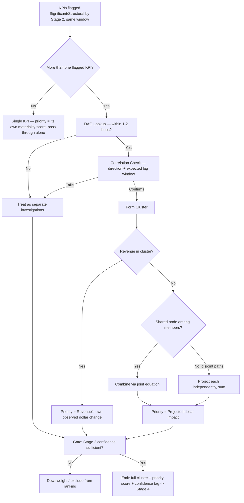

# Stage 3 — Cross-KPI Correlation & Prioritization
## Design Report — PS3 BusinessIntelligence.ai, Round 2 (AIC 2026)

**Status:** Design complete, pre-implementation. This is the architecture and rationale, no code — written so any team member can build from it without re-deriving the reasoning.

**Team credit:** The correlation-vs-causation framing, the materiality-based scaling instinct, and the composite-KPI proposal are Minhaj's own; this document formalizes each, names the established techniques being reused, and tightens the parts that didn't survive scrutiny — with the reasoning for each change recorded so the team can consciously accept or override it.

---

## 1. Purpose & Scope

Stage 3 receives KPIs that Stage 2 has **already, independently** flagged as Significant/Structural within the same time window. It does not re-judge whether any single KPI moved meaningfully — that judgment already happened per-metric in Stage 2.

Stage 3 has exactly two jobs:
1. **Grouping** — decide whether multiple flagged KPIs are one underlying story told twice, or genuine coincidences.
2. **Prioritization** — rank the resulting clusters (or lone ungrouped KPIs) by business impact, so downstream stages know what to investigate first.

**Hard boundary:** Stage 3 never touches *why* something moved (Stage 5), *where within* a KPI it's concentrated (Stage 4), or evidence (Stage 6). It hands Stage 4 a set of KPI-clusters with a priority order — nothing more.

**Prototype-scope discipline (explicit team decision):** with only 3–5 KPIs across 2–3 sources — the brief's own minimum — this stage does not need production-grade statistical machinery. Every mechanism below is deliberately the cheapest version that still demonstrates the right behavior, not the most rigorous one. Several heavier techniques were explicitly considered and rejected for this reason (noted inline).

---

## 2. Grouping — Correlation vs. Causation

**Team's initial framing:** two KPIs moving together (correlation) doesn't establish that one depends on the other (causation); causation implies a real dependency, correlation alone doesn't. Both checks are needed.

**Final design:**

### Causation check — reuse the DAG, don't build a discovery algorithm
The Structural Causal Model (Component C) already declares which KPIs are causally connected (`marketing_spend → traffic → orders → revenue`, etc.). This DAG **is** the causation signal. Stage 3 does not run live causal discovery (Granger causality tests, the PC algorithm) — that's real statistical machinery, genuinely overkill for a 3–5 KPI prototype, and would spend build time the team doesn't have. It looks up structural plausibility in a graph already committed to for Stage 8.

### Correlation check — confirm the plausible link actually fired this time
Being DAG-connected doesn't mean the connection is active in this specific incident. Correlation's job is to confirm that a structurally plausible relationship actually co-moved *this window* — not to stand alone as the causation test.

### Two refinements added on top of the team's initial two-check framing
1. **Lag alignment.** Some causal paths are immediate (marketing cut → traffic, same window); others are delayed and ramping (product outage → complaints → satisfaction → churn, over weeks) — this asymmetry is already stated in the original architecture report. A same-window-only correlation test would miss a churn-driven revenue drop paired with a support-ticket spike from three weeks earlier. Each DAG edge needs an expected-lag annotation, not just a direction.
2. **Direction consistency.** Co-movement isn't sufficient if the direction contradicts what the edge predicts (marketing spend *up* shouldn't correlate with traffic *down*). Match sign against what the edge implies, not just "did both move."

### The actual grouping test
Cluster two flagged KPIs only if **(a)** the DAG says they're within 1–2 hops, **and** **(b)** they show co-movement in the correct direction, within the expected lag window, for this specific incident.

### Failure mode — don't force it
If either check fails, treat the KPIs as separate investigations. This is a direct reuse of Stage 1 Scenario 6's "under-merging is the safer default" principle: forcing a false cluster contaminates the whole downstream investigation with a connection that looks exactly as credible as a real one, while treating them separately just costs two smaller, recoverable investigations.

---

## 3. Authoring the DAG

The DAG is **declared, not inferred** — the team hand-draws it once, at design time, for the specific 3–5 KPIs chosen for the prototype, based on the same structural equations already written into the simulator (`revenue = orders × AOV`, `orders = conversion × traffic`, etc.). Same "declare, don't infer" discipline as Stage 1's Semantic Contract.

Because the KPI set is small and deliberately chosen, every included KPI should have an authored path to revenue by construction — if one doesn't, that's a scope mistake in which KPIs were picked, not a gap in the reconciliation logic.

---

## 4. Prioritization — Business Impact, Not Percentage

**Team's initial proposal:** scale priority using Stage 2's materiality/significance score, weighted by percentage change rather than raw value (a 2→4 swing being a "bigger" signal than its raw numbers suggest).

**Problem identified:** percentage change is biased toward small-baseline metrics for the same reason raw value is biased toward large-baseline ones — neither is a fair common unit across genuinely different kinds of KPIs. A 5% revenue drop can represent far more real money than a 100% swing in a small counter metric.

**Final design — two separate axes, matching the brief's own language** ("materiality based on both statistical significance and business impact"):
- **Axis 1 — statistical significance** = Stage 2's confidence/materiality flag. Used as a **gate**, not a ranking scale: don't rank (or heavily downweight) a flag Stage 2 wasn't confident about. Same materiality-gate pattern reused from Stage 1.
- **Axis 2 — business impact** = a revenue-equivalent dollar projection. Used as the actual ranking scale across surviving clusters.

**Why dollars specifically:** it's the one unit every KPI in a deliberately-authored DAG can honestly be converted into, however indirectly, because the DAG is specifically built to connect the chosen KPIs back to revenue.

**Explicit scope guard:** this is a cheap, rough proxy using the SCM's existing equations — not a rigorous counterfactual. That precision belongs to Stage 8; duplicating it here would be over-engineering a ranking step that just needs to order 2–4 candidate clusters against each other.

---

## 5. Computing the Revenue-Equivalent Score

**Case 1 — revenue is already in the cluster (the common case).** Use revenue's own observed dollar change directly. Do not add other cluster members' projected impact on top — their movement is part of *why* revenue moved, not a separate loss; adding both would double-count the same money.

**Case 2 — revenue is not in the cluster (upstream-only flag).** Project the observed delta forward through the relevant equation chain. Example: a conversion-rate drop, run through `orders = conversion × traffic` using a known traffic baseline, then through `revenue = orders × AOV`, yields an implied dollar impact. This value is explicitly tagged **"projected,"** never conflated with an observed figure.

---

## 6. Multi-Path Combination Rule

For clusters with 3+ members reaching revenue via different routes, two genuinely different situations must be told apart before computing anything:

- **Shared-node paths** (e.g., conversion and traffic both feed the same `orders` equation): combine via the **joint equation**, using both observed deltas together in one computation. Projecting each independently and summing would double-count their interaction.
- **Disjoint paths** (no shared node — e.g., one route through AOV, another through churn): these represent genuinely separate contributions and **can** be projected independently and summed.

**Prototype-scope implementation:** with only 3–5 hand-drawn KPIs, this is a manual annotation made once when the DAG is authored (mark which nodes are shared) — not a generic graph-traversal solver. Deliberately not built as a general algorithm.

**Design-consistency note:** this joint-vs-disjoint handling is the same underlying spirit as Stage 5b's confounded-cause decomposer, just applied to ranking instead of diagnosis — the same philosophy showing up a second time, not a coincidence.

---

## 7. The Composite-KPI Idea — Where It Holds, Where It Breaks

**Team's proposal:** rather than picking one representative KPI per cluster to hand to Stage 4, synthesize a single hypothetical composite revenue-equivalent KPI per cluster, to avoid losing information about the other members.

**Where it holds:** for the ranking scalar itself (Job #2) — this is exactly the revenue-equivalent projection already built in Sections 5–6. No additional work needed there.

**Where it breaks:** as the object handed to Stage 4. A composite is a **formula output** — a single computed number with no dimensional structure of its own. It can't be decomposed by region/segment/product, because no such breakdown exists for a synthetic number; there's no "North region" version of a projected dollar figure sitting in any table. Attempting to construct one — decomposing each ingredient KPI by region, then recombining per region — would mean performing dimensional decomposition *inside* Stage 3, using Stage 4's own tools, before Stage 4 has run. That breaks the stage boundary set in Section 1.

**Final resolution:** don't compress the cluster before handoff at all. Pass the **whole cluster of real, untouched KPIs** to Stage 4; each gets decomposed independently, exactly as a lone flagged KPI would be. If a combined revenue-equivalent view is still useful downstream (e.g., feeding Stage 5's fingerprinting), it gets recomposed **after** decomposition, per region-bucket, from real decomposed data, using the same joint/disjoint logic from Section 6. Compose after decomposing — never before.

---

## 8. Stage 3 Output Contract (What Hands to Stage 4)

Every cluster (or lone KPI) Stage 3 emits carries:
- **The full set of contributing KPIs**, real data, untouched — not compressed to a representative, not synthesized into a composite
- **A priority score** — revenue-equivalent dollar impact (observed if revenue is in-cluster, projected otherwise), per Sections 5–6
- **The Stage 2 confidence/materiality tag**, carried through, not discarded
- **Explicitly absent:** any dimensional breakdown, cause hypothesis, or evidence — these remain Stage 4/5/6's responsibility respectively

---

## 9. Recurring Design Principles Reused in Stage 3

No new cross-cutting service was needed for this stage — everything reduced to principles and machinery already committed to:

1. **Materiality-gated action** — Stage 2's confidence used as a gate, not a scale (reused from Stage 1).
2. **Causal-graph-constrained reasoning** — the DAG as the causation check, extending Component C and Stage 1's cross-signal triangulation.
3. **Declare, don't infer** — the DAG and its shared-node/lag annotations are hand-authored once, not discovered live (same discipline as the Semantic Contract).
4. **Decline / don't force resolution** — failed grouping tests default to treating KPIs separately (direct reuse of Stage 1 Scenario 6's under-merge-is-safer ruling).
5. **Confounded-contribution handling** — joint vs. disjoint path combination mirrors Stage 5b's philosophy, applied here to ranking instead of diagnosis.

---

## 10. Scope Guard — What NOT to Build

- No live causal-discovery algorithm (Granger causality, PC algorithm) — the DAG is hand-authored.
- No rigorous counterfactual computation for ranking — that's Stage 8's job; Stage 3's projection is a first-order proxy.
- No generic graph-traversal solver for multi-path combination — manual shared-node annotation is sufficient at 3–5 KPIs.
- No representative-KPI selection or composite-KPI synthesis before handoff — the full cluster passes through untouched.

---

## 11. Stage 3 Internal Pipeline

---

## 12. Known Limitations (to state honestly to judges)

- The DAG's correctness depends entirely on how well the team authors it by hand; a real enterprise would need domain-expert validation or actual causal discovery, both out of scope for this build.
- Lag-window annotations are estimated by the team, not learned from data — there isn't enough historical volume at hackathon scale to fit lags empirically.
- The revenue-equivalent projection is a first-order approximation via the SCM's declared equations, not a validated causal estimate — that rigor is deliberately deferred to Stage 8, where it belongs.
